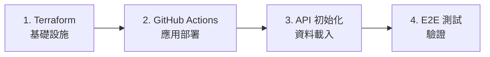

# 🚀 AI Square 部署架構重構完成

## 📋 背景

經過多天的部署問題調試，我們識別出根本原因是 **Terraform 試圖同時管理基礎設施和應用邏輯**，導致循環依賴和非冪等操作。

根據 SRE 專家建議，我們實施了完整的架構分離。

## 🏗️ 新架構概覽

### 責任分離

| 工具 | 負責範圍 | 觸發方式 |
|------|----------|----------|
| **Terraform** | 基礎設施：Cloud SQL, Cloud Run, IAM, 網路 | 手動執行 |
| **GitHub Actions** | 應用部署：Docker build, schema init, data loading | Git push 自動觸發 |

### 部署流程



## 📁 建立的檔案

### 1. 清理後的 Terraform 配置
- `terraform/main.tf` - 純基礎設施配置（已更名）
- `terraform/post-deploy.tf` - 基礎設施健康檢查（已更名）
- `terraform/Makefile` - 簡化的部署指令

### 2. GitHub Actions 工作流程
- `.github/workflows/deploy-staging.yml` - Staging 自動部署
- `.github/workflows/deploy-production.yml` - Production 保護性部署

### 3. Admin API 端點
- `frontend/src/app/api/admin/init-schema/route.ts` - Schema 驗證
- `frontend/src/app/api/admin/seed-users/route.ts` - Demo 帳號創建
- `frontend/src/app/api/admin/stats/route.ts` - 部署驗證統計

### 4. 驗證工具
- `scripts/verify-deployment.sh` - 增強的部署驗證腳本

### 5. 文檔
- `docs/deployment/terraform-github-actions-architecture.md` - 新架構詳細說明
- 更新的 `docs/deployment/cicd-deployment-and-db-guide.md`

## 🔧 修復的問題

### 問題 1: 循環依賴
**舊方式**: Terraform 需要 Cloud Run → Cloud Run 需要 DB schema → Schema 需要 API → API 需要 Terraform 完成

**新方式**: 
1. Terraform 建立基礎設施
2. GitHub Actions 透過 API 初始化應用

### 問題 2: 非冪等操作
**舊方式**: `always_run = "${timestamp()}"` 導致每次都強制執行

**新方式**: 
- 移除所有 timestamp 觸發器
- API 操作設計為冪等
- 可安全重複執行

### 問題 3: bcrypt 密碼不一致
**舊方式**: Terraform 生成 hash，應用驗證失敗

**新方式**: 
- GitHub Actions 透過 API 創建帳號
- 使用相同的 bcrypt 庫
- 一致的密碼處理

## 🚀 使用方法

### 首次部署

1. **部署基礎設施**
   ```bash
   # Staging
   make terraform-deploy-staging
   
   # Production（需要確認）
   make terraform-deploy-production
   ```

2. **設定 GitHub Secrets**
   ```bash
   gh secret set GCP_SA_KEY < staging-sa-key.json
   gh secret set GCP_SA_KEY_PROD < prod-sa-key.json
   ```

3. **部署應用**
   ```bash
   # Staging - 自動觸發
   git push origin staging
   
   # Production - 自動觸發（有保護措施）
   git push origin main
   ```

### 日常開發

```bash
# 開發變更
git commit -m "feat: add new feature"

# Staging 測試
git push origin staging
# GitHub Actions 自動：build → deploy → test → notify

# Production 發布
git push origin main
# GitHub Actions 自動：驗證 → 漸進式發布 → 監控
```

## 🛡️ 安全保護

### Staging（快速迭代）
- 無部署時間限制
- 自動覆寫資料
- 快速失敗，快速修復

### Production（多重保護）
- 部署時間窗口：9 AM - 6 PM（平日）
- 必須先驗證 Staging
- 漸進式流量切換（10% → 50% → 100%）
- 自動備份
- 失敗自動回滾

## 📊 驗證工具

### 部署後驗證
```bash
# 快速驗證
./scripts/verify-deployment.sh staging
./scripts/verify-deployment.sh production

# 詳細檢查
make check-staging
make check-production
```

### 監控端點
- Health: `/api/health`
- Admin stats: `/api/admin/stats` (需要 admin key)

## 🎯 關鍵改進

1. **可靠性**: 消除循環依賴，每個步驟都是獨立的
2. **可維護性**: 清晰的責任分離，easier debugging
3. **安全性**: Production 多重保護，Staging 快速迭代
4. **可觀察性**: 詳細的日誌和驗證，GitHub Actions 透明化
5. **可擴展性**: 易於添加新環境或修改流程

## 📈 效果

- ✅ **一鍵部署**: `git push` 觸發完整流程
- ✅ **零循環依賴**: 架構清晰，問題易定位
- ✅ **冪等操作**: 可安全重複執行
- ✅ **環境隔離**: Staging 靈活，Production 安全
- ✅ **可觀察性**: 每步驟都有日誌和驗證

---

**這個重構解決了之前「差一點點」的問題，實現了真正的一步到位部署架構。**

*Generated: 2025/08/21*