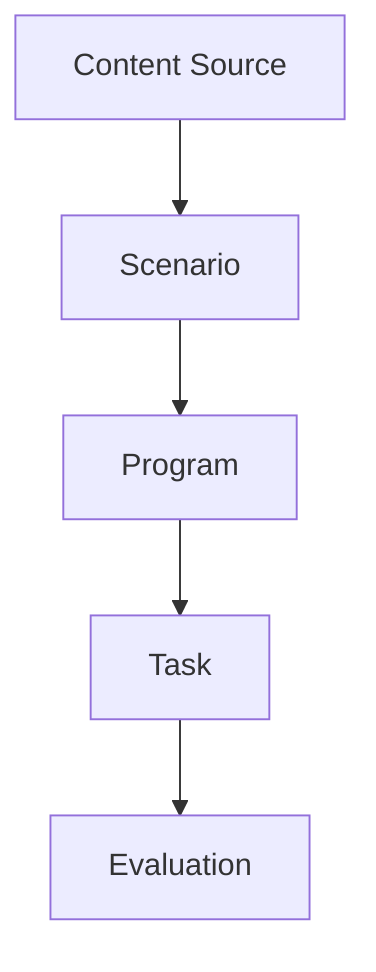

# Documentation CLAUDE.md - AI Square

Guidelines for maintaining AI Square documentation.

## 📚 Documentation Structure

```
docs/
├── handbook/
│   └── PRD.md                    # Product Requirements Document
├── technical/
│   └── infrastructure/
│       └── unified-learning-architecture.md  # Core architecture
├── deployment/
│   ├── CICD.md                   # CI/CD & deployment guide
│   └── local-deployment-guide.md # Local development setup
└── CLAUDE.md                     # This file
```

## ✍️ Writing Standards

### Markdown Style Guide

1. **Headers**: Use ATX-style headers (`#` not `===`)
   ```markdown
   # H1 Title
   ## H2 Section
   ### H3 Subsection
   ```

2. **Code Blocks**: Always specify language
   ```markdown
   ```typescript
   const foo: string = 'bar';
   ```
   ```

3. **Links**: Use reference-style for repeated links
   ```markdown
   See [architecture docs][arch] for details.

   [arch]: ./technical/infrastructure/unified-learning-architecture.md
   ```

4. **Lists**: Use `-` for unordered, `1.` for ordered
   ```markdown
   - Item 1
   - Item 2
     - Nested item

   1. Step 1
   2. Step 2
   ```

5. **Emoji Usage**: Consistent prefixes for visual hierarchy
   - 🎯 Goals/Objectives
   - ✅ Best practices
   - ❌ Anti-patterns
   - 🚨 Important warnings
   - 💡 Tips/Insights
   - 📊 Data/Metrics
   - 🔧 Configuration
   - 🚀 Actions/Commands

### Language Guidelines

- **Primary Language**: English for code, Chinese (Traditional) for product/user-facing docs
- **Technical Terms**: Use English technical terms, explain in Chinese if needed
  ```markdown
  Repository Pattern（儲存庫模式）是...
  ```
- **Consistency**: Same term for same concept throughout all docs

## 📋 Document Types & Templates

### 1. Technical Documentation

**Template Structure**:
```markdown
# Document Title

## Overview
Brief description of what this document covers.

## Prerequisites
- Requirement 1
- Requirement 2

## Core Concepts
### Concept 1
Explanation with examples

## Implementation Details
Step-by-step guides

## Examples
Practical code examples

## Troubleshooting
Common issues and solutions

## Related Documentation
- [Link to related doc](path)
```

### 2. API Documentation

**Template Structure**:
```markdown
# API Name

## Endpoint
`POST /api/resource`

## Request
```typescript
type RequestBody = {
  field: string;
};
```

## Response
```typescript
type ResponseBody = {
  id: string;
  field: string;
};
```

## Example
```bash
curl -X POST http://localhost:3000/api/resource \
  -H "Content-Type: application/json" \
  -d '{"field":"value"}'
```

## Error Codes
- `400` - Bad Request
- `404` - Not Found
- `500` - Internal Server Error
```

### 3. Tutorial/Guide

**Template Structure**:
```markdown
# Tutorial Title

## What You'll Learn
- Learning objective 1
- Learning objective 2

## Prerequisites
- Required knowledge
- Required tools

## Step 1: Setup
Detailed instructions

## Step 2: Implementation
Code examples with explanations

## Step 3: Verification
How to verify it works

## Next Steps
Where to go from here

## Troubleshooting
Common issues
```

## 🔄 Documentation Sync Rules

### When to Update Docs

**MUST update documentation when**:
1. **API Changes**: Any endpoint added/modified/removed
2. **Architecture Changes**: Database schema, new patterns, infrastructure
3. **Workflow Changes**: Development process, deployment procedures
4. **Configuration Changes**: Environment variables, build settings
5. **Breaking Changes**: Anything that requires developer action

### Auto-Sync Triggers

The `documentation-sync-agent` automatically updates docs after commits that:
- Modify database schema
- Change API routes
- Update package.json dependencies
- Modify deployment configs

### Manual Update Checklist

```bash
# When you make changes, check these files:
□ Does PRD.md need updating? (new features, changed priorities)
□ Does architecture doc need updating? (schema, patterns, models)
□ Does CICD.md need updating? (deployment process, env vars)
□ Does local-deployment-guide.md need updating? (dev setup steps)
□ Do code examples in docs still work?
```

## 📊 PRD.md Maintenance

### Update Frequency
- **Weekly**: Progress updates on current priorities
- **Monthly**: Review and adjust quarterly roadmap
- **As needed**: New features, changed strategy

### What to Include
```markdown
## Product Vision
High-level goals and target users

## Current Priorities (Ranked)
1. Priority 1 with rationale
2. Priority 2 with rationale

## Feature Specifications
### Feature Name
- User story
- Acceptance criteria
- Technical notes
- Status (Planning/In Progress/Complete)

## Success Metrics
- Metric 1: Target value
- Metric 2: Target value

## Known Issues & Tech Debt
- Issue description
- Impact assessment
- Planned resolution
```

## 🏗️ Architecture Documentation

### unified-learning-architecture.md Updates

**When to update**:
- ✅ New database tables/columns
- ✅ New Repository methods
- ✅ New API endpoints
- ✅ Data flow changes
- ✅ Caching strategy changes

**Update template**:
```markdown
## [New Section/Update]

### Context
Why this change is needed

### Implementation
Technical details

### Example
```typescript
// Code example
```

### Migration Notes
Steps to migrate existing data/code
```

## 🚀 Deployment Documentation

### CICD.md Updates

**Critical to document**:
- Environment variable changes
- New secrets in Secret Manager
- Cloud Run configuration changes
- GitHub Actions workflow changes
- Region/resource changes

### local-deployment-guide.md Updates

**Keep synchronized with**:
- Docker configurations
- Database setup steps
- Environment variable requirements
- Third-party service setup (Vertex AI, etc.)

## ✅ Quality Checklist

Before committing documentation changes:

```bash
□ Spelling and grammar checked
□ Code examples tested and working
□ Links verified (no broken links)
□ Consistent formatting throughout
□ Emoji usage follows standards
□ Version/date updated at bottom
□ Related docs cross-referenced
□ Clear and concise language
□ Technical accuracy verified
```

## 🔍 Review Process

### Self-Review Questions
1. Would a new developer understand this?
2. Are all steps clearly explained?
3. Are there enough examples?
4. Is anything missing or unclear?
5. Does this match the current codebase?

### Peer Review (for major changes)
- Request review for architecture changes
- Verify technical accuracy with domain expert
- Check for clarity and completeness

## 📝 Documentation Standards

### Code Examples

**Always include**:
- Full context (imports, type definitions)
- Comments explaining non-obvious parts
- Expected output/result
- Common pitfalls to avoid

**Example**:
```typescript
// Good example: Complete and clear
import { createProgramRepository } from '@/lib/db/program-repository';
import type { Program } from '@/types/program';

// Create repository instance
const repository = createProgramRepository();

// Fetch program with error handling
async function getProgram(id: string): Promise<Program | null> {
  try {
    return await repository?.getById?.(id);
  } catch (error) {
    console.error('Failed to fetch program:', error);
    return null;
  }
}

// Usage
const program = await getProgram('uuid-here');
if (!program) {
  // Handle not found case
}
```

### Diagrams and Visual Aids

**When to include**:
- Complex data flows
- Architecture overviews
- Process workflows
- State transitions

**Tools**:
- Mermaid (for markdown-embedded diagrams)
- Draw.io/Excalidraw (export as PNG)
- ASCII art (for simple diagrams)

**Example (Mermaid)**:


## 🐛 Troubleshooting Section Standards

**Structure**:
```markdown
### Problem: [Clear description]

**Symptoms**:
- Error message or behavior

**Cause**:
Root cause explanation

**Solution**:
```bash
# Step-by-step fix
```

**Prevention**:
How to avoid this in the future
```

## 🔗 Cross-Referencing

### Internal Links
- Use relative paths: `./technical/architecture.md`
- Reference specific sections: `./PRD.md#current-priorities`
- Keep links short and descriptive

### External Links
- Include context: `[Next.js 15 Docs](https://nextjs.org/docs)` not just URL
- Verify links periodically (especially version-specific docs)
- Prefer stable documentation links over blog posts

## 📦 Version Control for Docs

### Commit Messages for Docs
```
docs: update architecture with new Program model

- Add Program entity specification
- Update data flow diagram
- Add Repository Pattern examples
- Fix broken links to deployment guide
```

### When to Create New Versions
- Major architecture changes → Archive old version
- Breaking changes → Document migration path
- Deprecated features → Mark as deprecated, link to alternative

## 🎯 Success Metrics

**Documentation Quality Indicators**:
- Zero broken links
- All code examples working
- Up-to-date with codebase (< 1 week lag)
- Clear feedback from team (no confusion)
- Low support tickets for documented features

---

**Note**: This documentation guide should be followed by both AI and human contributors.
**Version**: 1.0 (2025-01-27)
