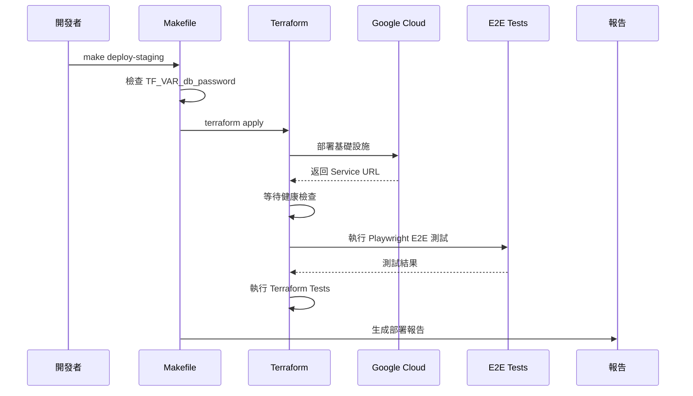
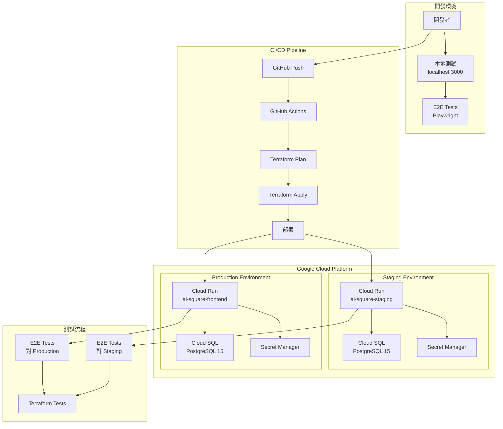
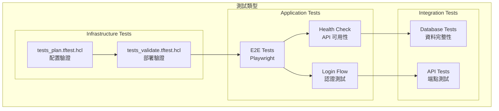
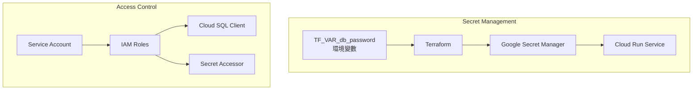
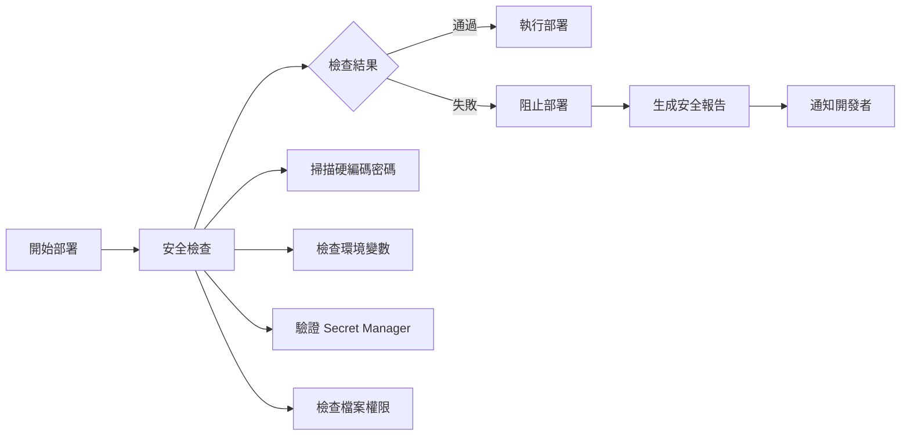

## CI/CD 部署與資料庫運維指南（使用 Terraform）

> **🚀 重要更新**：所有部署現在都使用 **Terraform** 進行管理，不再使用 shell scripts。

此文件聚焦「如何使用 Terraform 部署前後端」與「如何正確管理/遷移資料庫」。對應文件：

- PM（產品視角）：`docs/handbook/product-requirements-document.md`
- RD（技術架構）：`docs/technical/infrastructure/unified-learning-architecture.md`
- **Terraform 配置**：`terraform/` 目錄


### 目錄
- 一、Terraform 基礎設施管理
- 二、環境分層與配置
- 三、必要憑證與 Secret Manager
- 四、資料庫（Cloud SQL）管理
- 五、CI/CD 流程（使用 Terraform）
- 六、部署步驟（Staging & Production）
- 七、監控與健康檢查
- 八、常見問題（Troubleshooting）


---

### 一、Terraform 基礎設施管理

#### 🎯 核心原則：Infrastructure as Code

所有基礎設施都使用 Terraform 管理：

```bash
# Terraform 目錄結構
terraform/
├── main.tf                 # 主配置檔案
├── environments/
│   ├── staging.tfvars     # Staging 環境變數
│   └── production.tfvars  # Production 環境變數
└── .gitignore             # 忽略敏感資料
```

#### Terraform 管理的資源

- **Cloud SQL** (PostgreSQL 資料庫)
- **Cloud Run** (應用程式服務)
- **Secret Manager** (密碼管理)
- **Service Account** (IAM 權限)
- **Monitoring** (監控告警)

#### 關鍵原則

1. **Region 一致性**：Cloud Run 與 Cloud SQL 必須在同一個 Region (`asia-east1`)
2. **State 管理**：Terraform state 儲存在 GCS bucket
3. **密碼安全**：所有密碼使用 Secret Manager


---

### 二、環境分層與配置

#### 環境分層

| 環境 | 用途 | Terraform Workspace | 配置檔 |
|------|------|-------------------|--------|
| Local | 開發測試 | N/A | `.env.local` |
| Staging | 整合測試 | staging | `environments/staging.tfvars` |
| Production | 正式環境 | production | `environments/production.tfvars` |

#### Terraform 初始化

```bash
# 1. 初始化 Terraform
cd terraform
terraform init

# 2. 切換到正確的 workspace
terraform workspace select staging  # 或 production

# 3. 預覽變更
terraform plan -var-file="environments/staging.tfvars"

# 4. 套用變更
terraform apply -var-file="environments/staging.tfvars"
```

### 三、必要憑證與 Secret Manager

#### 使用 Secret Manager 管理密碼

Terraform 會自動建立和管理 Secret Manager：

```hcl
# main.tf 中的 Secret Manager 配置
resource "google_secret_manager_secret" "db_password" {
  secret_id = "db-password-${var.environment}"
  replication {
    auto {}
  }
}
```

#### 環境變數配置

Terraform 會自動設定以下環境變數：

1) **資料庫配置**
   - `DB_HOST`: `/cloudsql/PROJECT:REGION:INSTANCE` (Unix Socket)
   - `DB_NAME`: `ai_square_db`
   - `DB_USER`: `postgres`
   - `DB_PASSWORD`: 從 Secret Manager 讀取
   - `DATABASE_URL`: 完整連線字串（含 URL 編碼的密碼）

   **⚠️ 重要注意事項**：
   - 密碼中若含特殊字符（如 `#`、`@`、`%`），必須進行 URL 編碼
   - Terraform 使用 `urlencode()` 函數自動處理
   - 應用程式優先使用個別環境變數（DB_HOST、DB_PASSWORD）而非 DATABASE_URL

2) **應用程式配置**
   - `NODE_ENV`: `production`
   - `NEXTAUTH_SECRET`: 從 Secret Manager 讀取
   - `JWT_SECRET`: 從 Secret Manager 讀取

3) **Redis 配置** (可選)
   - `REDIS_ENABLED`: `true`/`false`
   - `REDIS_URL`: Redis 連線 URL
- 其他第三方金鑰（依服務需要放入 Secret Manager）

建議集中於：
- 本機：`frontend/.env.local`、`backend/.env.local`
- Staging/Prod：GCP Secret Manager + Cloud Run 環境變數


---

### 四、資料庫（Cloud SQL）管理

#### Terraform 管理 Cloud SQL

Terraform 會自動建立和管理 Cloud SQL 實例：

```hcl
# main.tf 中的 Cloud SQL 配置
resource "google_sql_database_instance" "main" {
  name             = "ai-square-db-${var.environment}-asia"
  database_version = "POSTGRES_15"
  region          = var.region
  
  settings {
    tier = var.environment == "production" ? "db-custom-2-4096" : "db-f1-micro"
    
    # 安全設定
    database_flags {
      name  = "log_connections"
      value = "on"
    }
    
    # 備份設定
    backup_configuration {
      enabled = var.environment == "production"
      start_time = "03:00"
    }
  }
}
```

#### 資料庫 Schema 管理

1) **Schema 版本**
   - 目前使用：`schema-v4.sql`
   - 位置：`frontend/src/lib/repositories/postgresql/schema-v4.sql`

2) **初始化方式**
   - Terraform 建立資料庫後，透過 API endpoint 初始化
   - 使用 `/api/admin/init-schema` 套用 schema

3) **備份策略**
   - Production：每日自動備份（凌晨 3:00）
   - Staging：不自動備份（節省成本）
   - 使用 `gcloud sql backups` 手動備份

4) **遷移策略**
   - 使用 `ALTER TABLE` 進行兼容式更新
   - 禁止破壞性變更
   - 先在 Staging 測試，再部署到 Production


---

### 五、CI/CD 流程（使用 Terraform）

#### 🚀 完整自動化部署架構 (2025/01 新增)

##### 最佳實踐部署流程



##### 一鍵部署系統

```bash
# 設定密碼（只需一次）
export TF_VAR_db_password="AiSquare2025Db#"

# 完整自動化部署（包含所有測試）
make deploy-staging    # 部署到 Staging
make deploy-production # 部署到 Production

# CI/CD 整合（無互動）
make ci-deploy ENV=staging
```

##### Terraform 檔案架構

```
terraform/
├── 📄 基礎設施定義
│   ├── main.tf              # Cloud SQL, Cloud Run, IAM
│   ├── post-deploy.tf       # 資料庫初始化
│   └── e2e.tf              # E2E 測試整合
│
├── 🔧 自動化工具
│   ├── Makefile            # 簡化命令介面
│   └── deploy-complete.sh  # 完整部署腳本
│
├── 🧪 測試套件
│   ├── tests_plan.tftest.hcl     # 配置驗證
│   ├── tests_validate.tftest.hcl # 部署驗證
│   └── tests_e2e_integration.tftest.hcl # E2E 整合
│
└── 🔐 環境設定
    └── environments/
        ├── staging.tfvars
        └── production.tfvars
```

#### 部署前檢查清單

- [ ] Terraform state 已初始化
- [ ] 所有資源已導入 Terraform state
- [ ] Secret Manager 已設定所有密碼
- [ ] Cloud SQL 與 Cloud Run 在同一 Region
- [ ] Service Account 權限正確
- [ ] E2E 測試檔案已準備
- [ ] Terraform test 已配置

#### GitHub Actions 整合

```yaml
# .github/workflows/deploy.yml
name: Deploy with Terraform

on:
  push:
    branches:
      - main  # Production
      - staging  # Staging

jobs:
  deploy:
    runs-on: ubuntu-latest
    steps:
      - uses: actions/checkout@v3
      
      - name: Setup Terraform
        uses: hashicorp/setup-terraform@v2
        
      - name: Terraform Init
        run: |
          cd terraform
          terraform init
          
      - name: Terraform Apply
        run: |
          cd terraform
          if [ "${{ github.ref }}" == "refs/heads/main" ]; then
            terraform apply -var-file="environments/production.tfvars" -auto-approve
          else
            terraform apply -var-file="environments/staging.tfvars" -auto-approve
          fi
```
- 輔助腳本：`frontend/deploy-staging.sh`、`frontend/scripts/init-staging-cloud-sql.sh`

建議將「DB Schema 套用」做為部署前置或部署後置步驟（migrate job），確保程式碼與資料庫同步。


---

### 五、前端部署（Next.js）

#### 🚀 統一部署系統（2025/01 新增）

**重要改進**：為了確保 Staging 和 Production 環境的一致性，現在使用統一的部署腳本 `deploy.sh`，避免環境間的差異導致問題。

##### 使用統一部署腳本
```bash
cd frontend

# 部署到 Staging
./deploy.sh staging

# 部署到 Production  
./deploy.sh production

# 本地測試
./deploy.sh local
```

##### 統一配置檔案
所有環境配置都在 `deploy.config.json` 中管理：
- 資料庫連線資訊
- Cloud SQL 實例名稱
- Demo 帳號密碼
- 資源配置（CPU、記憶體）

##### 使用 Makefile 命令（推薦）
```bash
# Staging 部署
make deploy-staging

# Production 部署
make deploy-production

# 本地測試
make deploy-local
```

#### 手動部署（舊方式，僅供參考）
```bash
# 舊的分離式腳本（已棄用）
./deploy-staging.sh     # 僅 Staging
./deploy-production.sh   # 僅 Production

# 建議改用統一部署系統
./deploy.sh [staging|production]
```

#### Cloud Run 部署要點
1) Cloud Run（建議）
- 以 Docker 方式建置映像 → 推送 Artifact Registry → Cloud Run 部署
- 關鍵：Cloud Run 與 Cloud SQL 同區域；若走 Unix Socket，將 `DB_HOST` 設為 `/cloudsql/PROJECT:REGION:INSTANCE`

2) 健康檢查與驗收
- 健康檢查端點（範例）：`/api/monitoring/health`（專案內亦有 `/api/health` 與 KSA/relations 等端點可檢）
- 部署後以 curl 驗證：
```bash
curl -s "https://<your-service-url>/api/monitoring/health" | jq
```

3) 環境變數（必要）
- `NEXTAUTH_SECRET`（必須設定，否則認證功能失效）
- `JWT_SECRET`（必須設定）
- `DB_*`（Host/Name/User/Password）
- `REDIS_*`（若啟用）


---

### 六、後端部署（FastAPI/其他服務）

若使用 FastAPI：
1) 同樣以 Docker 建置映像，將 `DB_*`、`REDIS_*` 帶入容器環境
2) 在 Cloud Run / GKE 或其他環境運行
3) 以 `uvicorn` 啟動並設定健康檢查端點（/health）


---

### 七、快取（Redis）與健康檢查

1) Redis 啟動（本機測試）
```bash
docker run -d --name ai-square-test-redis -p 6380:6379 redis:7
export REDIS_ENABLED=true
export REDIS_URL=redis://localhost:6380
```

2) 整合測試時的建議
- 對 cache 標頭（`X-Cache`）的斷言採寬鬆策略（HIT/SWR/MISS/undefined）以降低 CI 偶發性
- Redis 斷線時應具備 fallback（memory/localStorage/DB）

3) 健康檢查與監控
- 部署後請於 CI 加入 smoke test：
```bash
curl -s "https://<svc>/api/relations?lang=en" | jq '.'
curl -s "https://<svc>/api/assessment/scenarios?lang=en" | jq '.'
```


---

### 八、常見問題（Troubleshooting）

1) Cloud Run ↔ Cloud SQL 連線逾時 / relation does not exist
- 檢查 Region 是否一致
- 若用 Unix Socket，`DB_HOST` 應為 `/cloudsql/PROJECT:REGION:INSTANCE` 且不需要 port
- 若用 Private IP + VPC Connector，確認 Connector 正常與防火牆規則

2) 整合測試大量失敗（本機/CI）
- 未啟動測試 DB/Redis：請先起容器或設 `USE_SHARED_DB=1` 指向現有 DB
- 斷言過嚴：已於多數測試放寬 SLA（p95/p50）與 cache header；若仍失敗請檢查真實 API 回應

3) DB 遷移衝突
- 大版本升級（v3 → v4）務必先在 Staging 試跑並備份
- 用 `ALTER` 保持向後相容，避免破壞性 drop

4) 型別/ESLint 阻擋部署
- 先跑：`npm run typecheck && npm run lint`，修正後再 build/deploy

5) 健康檢查 OK、頁面空白
- 檢查 `.env` 是否遺漏 `NEXTAUTH_SECRET` 或 DB/Redis 相關
- 檢查 Cloud Run Service Logs（Runtime 500 常見於 env/連線）


---

### 九、Production 環境基礎建設 SOP

#### 🚨 重要：Production 環境必須獨立於 Staging

**絕對不要共用 Staging 的資源**，特別是：
- ❌ 不要共用 Cloud SQL 實例
- ❌ 不要共用 Secrets
- ❌ 不要共用 Service Account

#### Step 1: 建立 Production Cloud SQL 實例

```bash
# 1. 建立 Production 資料庫實例
gcloud sql instances create ai-square-db-production \
  --database-version=POSTGRES_15 \
  --tier=db-n1-standard-1 \
  --region=asia-east1 \
  --network=default \
  --backup \
  --backup-start-time=03:00 \
  --maintenance-window-day=SUN \
  --maintenance-window-hour=03 \
  --maintenance-release-channel=production \
  --project=ai-square-463013

# 2. 建立資料庫
gcloud sql databases create ai_square_db \
  --instance=ai-square-db-production \
  --project=ai-square-463013

# 3. 設定資料庫密碼（使用強密碼）
gcloud sql users set-password postgres \
  --instance=ai-square-db-production \
  --password="YOUR_STRONG_PASSWORD" \
  --project=ai-square-463013
```

#### Step 2: 建立 Production Service Account

```bash
# 1. 建立專用的 Service Account
gcloud iam service-accounts create ai-square-production \
  --display-name="AI Square Production Service Account" \
  --project=ai-square-463013

# 2. 設定 Service Account 變數
SERVICE_ACCOUNT="ai-square-production@ai-square-463013.iam.gserviceaccount.com"

# 3. 授予必要權限
# Cloud SQL Client
gcloud projects add-iam-policy-binding ai-square-463013 \
  --member="serviceAccount:${SERVICE_ACCOUNT}" \
  --role="roles/cloudsql.client"

# Secret Manager Accessor
gcloud projects add-iam-policy-binding ai-square-463013 \
  --member="serviceAccount:${SERVICE_ACCOUNT}" \
  --role="roles/secretmanager.secretAccessor"

# Cloud Storage (如需要)
gcloud projects add-iam-policy-binding ai-square-463013 \
  --member="serviceAccount:${SERVICE_ACCOUNT}" \
  --role="roles/storage.objectViewer"

# Cloud Run Invoker (如需要)
gcloud projects add-iam-policy-binding ai-square-463013 \
  --member="serviceAccount:${SERVICE_ACCOUNT}" \
  --role="roles/run.invoker"
```

#### Step 3: 設定 Production Secrets

```bash
# 執行 setup script 或手動建立
cd scripts
chmod +x setup-production-secrets.sh
./setup-production-secrets.sh

# 或手動建立每個 secret：

# 1. 資料庫密碼（使用與 Step 1 相同的密碼）
echo -n "YOUR_STRONG_PASSWORD" | \
  gcloud secrets create db-password-production --data-file=- --project=ai-square-463013

# 2. NextAuth Secret（隨機生成）
echo -n "$(openssl rand -base64 32)" | \
  gcloud secrets create nextauth-secret-production --data-file=- --project=ai-square-463013

# 3. JWT Secret（隨機生成）
echo -n "$(openssl rand -base64 32)" | \
  gcloud secrets create jwt-secret-production --data-file=- --project=ai-square-463013

# 4. Claude API Key（使用實際的 key）
echo -n "YOUR_CLAUDE_API_KEY" | \
  gcloud secrets create claude-api-key-production --data-file=- --project=ai-square-463013

# 5. Admin Init Key（用於保護初始化端點）
echo -n "$(openssl rand -base64 24)" | \
  gcloud secrets create admin-init-key-production --data-file=- --project=ai-square-463013

# 6. Google Credentials（如需要）
gcloud secrets create google-credentials-production \
  --data-file=path/to/service-account.json \
  --project=ai-square-463013
```

#### Step 4: 更新部署設定檔

更新以下檔案中的 Cloud SQL 實例名稱：

1. **frontend/deploy-production.sh**
```bash
# 從：
CLOUD_SQL_INSTANCE="ai-square-463013:asia-east1:ai-square-db-staging-asia"
# 改為：
CLOUD_SQL_INSTANCE="ai-square-463013:asia-east1:ai-square-db-production"
```

2. **frontend/.github/workflows/deploy-production.yml**
```yaml
# 從：
CLOUD_SQL_INSTANCE: ai-square-463013:asia-east1:ai-square-db-staging-asia
# 改為：
CLOUD_SQL_INSTANCE: ai-square-463013:asia-east1:ai-square-db-production
```

#### Step 5: 初始化資料庫 Schema

```bash
# 方法 1: 使用 Cloud SQL Proxy（推薦）
# 安裝 Cloud SQL Proxy
curl -o cloud-sql-proxy \
  https://storage.googleapis.com/cloud-sql-connectors/cloud-sql-proxy/v2.8.0/cloud-sql-proxy.linux.amd64
chmod +x cloud-sql-proxy

# 啟動 proxy
./cloud-sql-proxy --port 5433 \
  ai-square-463013:asia-east1:ai-square-db-production &

# 套用 schema
PGPASSWORD="YOUR_STRONG_PASSWORD" psql \
  -h localhost \
  -p 5433 \
  -U postgres \
  -d ai_square_db \
  -f frontend/src/lib/repositories/postgresql/schema-v4.sql

# 方法 2: 部署後使用 HTTP API
# 部署服務後執行
curl -X POST "https://YOUR-SERVICE-URL/api/admin/init-schema" \
  -H "x-admin-key: YOUR_ADMIN_KEY" \
  -H "Content-Type: application/json"
```

#### Step 6: 執行 Production 部署

```bash
# 使用 Makefile
make deploy-production

# 或使用部署腳本
cd frontend
./deploy-production.sh

# 或使用 GitHub Actions（推薦）
# Push 到 production 分支會自動觸發
```

#### Step 7: 初始化 Scenarios

```bash
SERVICE_URL="https://ai-square-frontend-731209836128.asia-east1.run.app"

# Assessment scenarios
curl -X POST "${SERVICE_URL}/api/admin/init-assessment" \
  -H "Content-Type: application/json" \
  -d '{"force": false}'

# PBL scenarios
curl -X POST "${SERVICE_URL}/api/admin/init-pbl" \
  -H "Content-Type: application/json" \
  -d '{"force": false}'

# Discovery scenarios
curl -X POST "${SERVICE_URL}/api/admin/init-discovery" \
  -H "Content-Type: application/json" \
  -d '{"force": false}'
```

#### Step 8: 驗證部署

```bash
# 1. 健康檢查
curl "https://YOUR-SERVICE-URL/api/health"

# 2. 檢查資料庫連線
curl "https://YOUR-SERVICE-URL/api/admin/init-schema"

# 3. 檢查 scenarios
curl "https://YOUR-SERVICE-URL/api/assessment/scenarios?lang=en"
curl "https://YOUR-SERVICE-URL/api/pbl/scenarios?lang=en"
curl "https://YOUR-SERVICE-URL/api/discovery/scenarios?lang=en"
```

#### Production 環境檢查清單

- [ ] Cloud SQL Production 實例已建立
- [ ] 資料庫 `ai_square_db` 已建立
- [ ] 資料庫密碼已設定（強密碼）
- [ ] Service Account 已建立並授權
- [ ] 所有 Production Secrets 已建立
- [ ] 部署設定檔已更新為 production 實例
- [ ] Schema v4 已套用
- [ ] Cloud Run 服務已部署
- [ ] Scenarios 已初始化
- [ ] 健康檢查通過
- [ ] DNS 記錄已更新（如需要）
- [ ] 監控告警已設定
- [ ] 備份策略已啟用

### 十、GitHub Actions Secrets 設定

在 GitHub Repository Settings → Secrets and variables → Actions 中設定：

#### Staging 環境 Secrets：
- `GCP_SA_KEY`: Staging Service Account JSON key
- `NEXTAUTH_SECRET`: Staging NextAuth secret
- `JWT_SECRET`: Staging JWT secret
- `SLACK_WEBHOOK_URL`: （可選）Slack 通知 webhook URL

#### Production 環境 Secrets：
- `GCP_SA_KEY_PRODUCTION`: Production Service Account JSON key
- `NEXTAUTH_SECRET_PRODUCTION`: Production NextAuth secret（與 Secret Manager 一致）
- `JWT_SECRET_PRODUCTION`: Production JWT secret（與 Secret Manager 一致）
- `ADMIN_INIT_KEY`: Admin 初始化 key（保護初始化端點）
- `SLACK_WEBHOOK_URL`: （可選）Slack 通知 webhook URL

設定步驟：
1. 進入 GitHub Repository → Settings → Secrets and variables → Actions
2. 點擊 "New repository secret"
3. 輸入 Name（如 `GCP_SA_KEY_PRODUCTION`）和 Value
4. 點擊 "Add secret"

### 十一、Production 成本估算與優化

#### 月成本估算（asia-east1 區域）

**基礎配置**（推薦起始配置）：
- Cloud Run (1 CPU, 1Gi, min=1): ~$50-100/月
- Cloud SQL (db-n1-standard-1): ~$50-70/月
- Cloud Storage: ~$5-10/月
- Secret Manager: ~$0.06/secret/月
- **總計**: ~$105-180/月

**成本優化選項**：

1. **開發/測試環境**（最低成本）：
```bash
# 使用 shared-core 實例
gcloud sql instances create ai-square-db-dev \
  --database-version=POSTGRES_15 \
  --tier=db-f1-micro \  # ~$15/月
  --region=asia-east1

# Cloud Run 設定最小實例為 0
--min-instances 0  # 允許 cold start，節省閒置成本
```

2. **Production 優化**：
```bash
# 使用 Cloud Scheduler 在非尖峰時段縮減
# 例如：晚上 10 點後降低 min-instances
gcloud scheduler jobs create http scale-down \
  --schedule="0 22 * * *" \
  --uri="https://run.googleapis.com/v2/projects/PROJECT/locations/REGION/services/SERVICE" \
  --update-service-min-instances=0
```

3. **監控成本**：
```bash
# 設定預算警報
gcloud billing budgets create \
  --billing-account=BILLING_ACCOUNT_ID \
  --display-name="AI Square Production Budget" \
  --budget-amount=200 \
  --threshold-rule=percent=50,basis=current-spend \
  --threshold-rule=percent=90,basis=current-spend \
  --threshold-rule=percent=100,basis=current-spend
```

### 十二、監控與告警設定

#### 基礎監控
```bash
# 1. 設定 Uptime Check
gcloud monitoring uptime-check-configs create \
  --display-name="AI Square Production Health" \
  --resource-type="uptime-url" \
  --monitored-resource="{'host': 'ai-square-frontend-731209836128.asia-east1.run.app'}" \
  --http-check="{'path': '/api/health', 'port': 443, 'use-ssl': true}" \
  --period="5m"

# 2. 設定錯誤率告警
gcloud monitoring policies create \
  --notification-channels=CHANNEL_ID \
  --display-name="High Error Rate" \
  --condition-display-name="5xx errors > 1%" \
  --condition-metric-type="run.googleapis.com/request_count" \
  --condition-filter="metric.label.response_code_class='5xx'" \
  --condition-comparison="COMPARISON_GT" \
  --condition-threshold-value=0.01
```

#### 關鍵指標監控
- Request latency (p50, p95, p99)
- Error rate (4xx, 5xx)
- Database connections
- Memory usage
- Cold start frequency

### 附：現有部署腳本/設定（供參考）

#### Staging 環境：
- GitHub Actions Workflow：`frontend/.github/workflows/deploy-staging.yml`
- Cloud Build 設定（選用）：`frontend/cloudbuild.staging.yaml`
- Staging 部署腳本：`frontend/deploy-staging.sh`
- Cloud SQL 初始化腳本：`frontend/scripts/init-staging-cloud-sql.sh`

#### Production 環境：
- GitHub Actions Workflow：`frontend/.github/workflows/deploy-production.yml`
- Production 部署腳本：`frontend/deploy-production.sh`
- Dockerfile：`frontend/Dockerfile.production`
- Secrets 設定腳本：`scripts/setup-production-secrets.sh`
- 部署參數文檔：`docs/deployment/production-deployment-parameters.md`

#### 共用資源：
- DB Schema（最新）：`frontend/src/lib/repositories/postgresql/schema-v4.sql`
- Makefile 命令：`make deploy-staging`, `make deploy-production`

以上腳本可直接整合至 CI/CD Pipeline：先測試與型別檢查，套用/驗證 DB Schema，最後部署至 Cloud Run，並以 smoke test 驗證。

### 重要提醒

1. **環境隔離**：Production 必須有獨立的資源（DB、Secrets、Service Account）
2. **區域一致**：Cloud SQL 和 Cloud Run 必須在同一區域（asia-east1）
3. **密碼安全**：Production 密碼必須使用強密碼，並存在 Secret Manager
4. **備份策略**：Production DB 必須啟用自動備份
5. **監控告警**：設定關鍵指標監控和錯誤告警
6. **成本控制**：設定預算警報，定期檢視成本報告

---

## 十六、完整部署架構圖 (2025/01 新增)

### 系統架構總覽



### 資源關聯架構

```mermaid
graph LR
    subgraph "Terraform Resources"
        ServiceAccount[google_service_account<br/>ai-square-service]
        
        SQL[google_sql_database_instance<br/>ai-square-db-{env}]
        DB[google_sql_database<br/>ai_square_db]
        
        CloudRun[google_cloud_run_service<br/>ai-square-{env}]
        
        Secret[google_secret_manager_secret<br/>db-password-{env}]
        
        IAM1[google_project_iam_member<br/>cloudsql.client]
        IAM2[google_project_iam_member<br/>secretmanager.secretAccessor]
        
        Monitor[google_monitoring_uptime_check_config]
        Alert[google_monitoring_alert_policy]
    end
    
    ServiceAccount --> IAM1
    ServiceAccount --> IAM2
    CloudRun --> ServiceAccount
    CloudRun --> SQL
    CloudRun --> Secret
    SQL --> DB
    CloudRun --> Monitor
    Monitor --> Alert
```

### 測試架構



### 安全架構



### Makefile 命令總覽

```bash
# 部署命令
make deploy-staging       # 完整部署到 Staging
make deploy-production    # 完整部署到 Production
make ci-deploy           # CI/CD 無互動部署

# 測試命令
make test               # 執行 Terraform 測試
make e2e                # 執行 E2E 測試

# 維護命令
make status             # 查看部署狀態
make logs               # 查看 Cloud Run 日誌
make destroy-staging    # 銷毀 Staging 環境
make destroy-production # 銷毀 Production 環境

# 輔助命令
make init               # 初始化 Terraform
make plan               # 預覽變更
make apply              # 套用變更
make clean              # 清理檔案
```

### 關鍵特性

1. **完全自動化**：一個命令完成所有部署步驟
2. **零人工介入**：除了初始密碼設定，無需任何輸入
3. **完整測試覆蓋**：基礎設施 + E2E + 整合測試
4. **安全管理**：Secret Manager 管理所有敏感資訊
5. **多環境支援**：Staging 和 Production 獨立部署
6. **錯誤恢復**：自動重試和錯誤處理機制
7. **部署報告**：自動生成包含測試結果的報告
8. **安全檢查**：自動執行安全審計，防止洩露敏感資訊

---

## 十七、🔒 安全審計與 CI/CD 整合 (2025/01 新增)

### CI/CD 自動化實際實施狀態

#### ✅ 已完全實施並運作的自動化：

1. **基礎 CI Pipeline** (`/.github/workflows/ci.yml`)
   - ✅ TypeScript 編譯檢查
   - ✅ ESLint 程式碼品質檢查  
   - ✅ Jest 單元測試執行
   - ✅ 測試覆蓋率報告 (Codecov)
   - ✅ npm audit 安全掃描
   - ✅ TruffleHog 敏感資訊掃描
   - ✅ Conventional commits 檢查

2. **Terraform 自動化** (`/.github/workflows/terraform.yml`)
   - ✅ Terraform plan 自動執行
   - ✅ Terraform apply (staging 自動, production 需要審核)
   - ✅ Security check 腳本執行
   - ✅ 多環境支援 (workspace)
   - ✅ 健康檢查驗證

3. **部署自動化** (`/.github/workflows/deploy.yml`)
   - ✅ Docker image 建置和推送
   - ✅ Cloud Run 部署
   - ✅ 環境變數配置
   - ✅ Slack 通知

#### ⚠️ 已配置但未完全自動化：

1. **容器安全掃描**
   - 配置位置：`deploy-complete.yml` (Trivy)
   - 實際狀態：未整合到主要部署流程
   - 需要手動觸發或使用 `deploy-complete.yml` workflow

2. **藍綠部署**
   - 配置位置：`terraform/blue-green-deployment.tf`
   - 實際狀態：Terraform 模組已建立但未在 CI/CD 中使用
   - 需要手動執行流量切換腳本

3. **E2E 測試自動執行**
   - 配置位置：`terraform/e2e.tf`, `terraform/Makefile`
   - 實際狀態：在主要 deploy workflow 中被註解掉
   - 需要手動執行 `make e2e`

4. **監控告警**
   - 配置位置：`terraform/monitoring.tf`
   - 實際狀態：Terraform 已定義但需要確認 Slack webhook 和實際觸發

#### ❌ 尚未實施：

1. **自動回滾機制**
   - 有配置在 `deploy-complete.yml` 但不是主要部署路徑
   - 需要手動使用 Terraform 回滾

2. **自動晉升 (Auto-promotion)**
   - 無自動從 staging 到 production 的機制
   - 所有 production 部署需要手動觸發

3. **效能測試**
   - 只有基本的建置時間檢查
   - 無實際的負載測試或效能基準測試

### 部署前安全檢查流程



### 自動化安全檢查

#### Pre-deployment Security Checklist

```bash
# 部署前必須通過的安全檢查
make security-check    # 執行完整安全審計
```

安全檢查項目：

1. **硬編碼密碼檢查** (✅ 已實施)
   - 掃描所有檔案中的密碼模式
   - 檢查 .env 檔案是否在版本控制中
   - 驗證敏感資訊是否使用環境變數

2. **Secret Manager 驗證** (⚠️ 部分實施)
   - 確認所有必要的 secrets 已建立
   - 驗證服務帳號權限
   - 檢查 secret 版本和輪替策略

3. **配置檔案審計** (✅ 已實施)
   - 檢查 `.env.production.yaml` 無硬編碼密碼
   - 驗證 Terraform 變數使用環境變數
   - 確認 GitHub Actions secrets 設定

### 安全檢查腳本

```bash
#!/bin/bash
# security-check.sh - CI/CD 安全檢查腳本

set -e

echo "🔒 執行安全審計..."

# 1. 檢查硬編碼密碼
echo "檢查硬編碼密碼..."
HARDCODED=$(grep -r "password\|secret\|key" --include="*.yaml" --include="*.yml" --include="*.env" . 2>/dev/null | grep -v "^\*" | grep -v "example" | grep -v "template" || true)

if [ ! -z "$HARDCODED" ]; then
    echo "❌ 發現可能的硬編碼密碼："
    echo "$HARDCODED"
    exit 1
fi

# 2. 檢查 .env 檔案
echo "檢查環境檔案..."
if git ls-files | grep -E "\.env$|\.env\.production$|\.env\.staging$" | grep -v "\.example"; then
    echo "❌ 發現 .env 檔案在版本控制中"
    exit 1
fi

# 3. 驗證 Secret Manager
echo "驗證 Secret Manager..."
REQUIRED_SECRETS=(
    "db-password-${ENVIRONMENT}"
    "nextauth-secret-${ENVIRONMENT}"
    "jwt-secret-${ENVIRONMENT}"
)

for secret in "${REQUIRED_SECRETS[@]}"; do
    if ! gcloud secrets describe "$secret" &>/dev/null; then
        echo "❌ Secret 不存在: $secret"
        exit 1
    fi
done

# 4. 檢查 Terraform 配置
echo "檢查 Terraform 配置..."
if grep -r "password.*=.*\"" terraform/ --include="*.tf" | grep -v "var\." | grep -v "data\."; then
    echo "❌ Terraform 檔案中發現硬編碼密碼"
    exit 1
fi

echo "✅ 安全檢查通過"
```

### CI/CD Pipeline 整合

#### GitHub Actions 安全檢查

```yaml
# .github/workflows/security-check.yml
name: Security Audit

on:
  push:
    branches: [main, staging, production]
  pull_request:
    branches: [main]

jobs:
  security-audit:
    runs-on: ubuntu-latest
    steps:
      - uses: actions/checkout@v3
      
      - name: Run Security Check
        run: |
          chmod +x ./scripts/security-check.sh
          ./scripts/security-check.sh
      
      - name: Scan for Secrets
        uses: trufflesecurity/trufflehog@main
        with:
          path: ./
          
      - name: Check Dependencies
        run: |
          npm audit --audit-level=moderate
          
      - name: SAST Scan
        uses: aquasecurity/trivy-action@master
        with:
          scan-type: 'config'
          scan-ref: '.'
```

### 安全最佳實踐

#### 1. 密碼管理

```bash
# ❌ 錯誤：硬編碼密碼
DB_PASSWORD: "AiSquare2025Db#"

# ✅ 正確：使用 Secret Manager
DB_PASSWORD: "${DB_PASSWORD}"  # 從 Secret Manager 讀取
```

#### 2. 環境變數配置

```yaml
# .env.example (可以提交到 Git)
DB_HOST=/cloudsql/PROJECT:REGION:INSTANCE
DB_NAME=ai_square_db
DB_USER=postgres
DB_PASSWORD=your-secure-password-here  # 範例值

# .env.production (不要提交到 Git)
DB_PASSWORD=ActualSecurePassword123!  # 實際密碼
```

#### 3. Secret Rotation 策略

```bash
# 定期輪替密碼（每季度）
gcloud scheduler jobs create http rotate-secrets \
  --schedule="0 0 1 */3 *" \
  --uri="https://YOUR-FUNCTION-URL/rotate-secrets" \
  --http-method=POST
```

### 安全監控與告警

```yaml
# monitoring-rules.yaml
alertPolicy:
  displayName: "Suspicious Access Alert"
  conditions:
    - displayName: "High rate of 401 errors"
      conditionThreshold:
        filter: 'resource.type="cloud_run_revision" 
                 AND metric.type="run.googleapis.com/request_count"
                 AND metric.label.response_code="401"'
        comparison: COMPARISON_GT
        thresholdValue: 10
        duration: 60s
```

### Makefile 安全命令

```makefile
# 安全相關命令
security-check: ## 執行完整安全審計
	@echo "🔒 執行安全審計..."
	@./scripts/security-check.sh
	@echo "🔍 掃描敏感資訊..."
	@trufflehog filesystem . --no-verification
	@echo "📊 檢查相依套件..."
	@cd frontend && npm audit
	@echo "✅ 安全檢查完成"

rotate-secrets: ## 輪替所有 secrets
	@echo "🔄 輪替 secrets..."
	@./scripts/rotate-secrets.sh

security-report: ## 生成安全報告
	@echo "📋 生成安全報告..."
	@./scripts/generate-security-report.sh > security-report-$(date +%Y%m%d).md
```

### 安全檢查清單

部署前必須確認：

- [ ] 無硬編碼密碼在程式碼中
- [ ] 所有 .env 檔案已加入 .gitignore
- [ ] Secret Manager 已設定所有必要 secrets
- [ ] 服務帳號權限遵循最小權限原則
- [ ] HTTPS 已啟用且強制使用
- [ ] 資料庫備份已啟用
- [ ] 監控告警已設定
- [ ] 安全審計日誌已啟用
- [ ] Rate limiting 已配置
- [ ] CORS 設定正確

### 事件回應計畫

發現安全問題時：

1. **立即行動**
   - 撤銷洩露的憑證
   - 輪替所有相關密碼
   - 檢查存取日誌

2. **調查範圍**
   - 確認影響時間範圍
   - 識別受影響的系統
   - 評估資料外洩風險

3. **修復與預防**
   - 修正安全漏洞
   - 更新安全檢查腳本
   - 加強監控機制

## 十八、CI/CD 自動化完善計畫

### 🎯 需要完成的自動化項目

#### 1. 容器安全掃描整合
```yaml
# 將 Trivy 掃描加入主要部署流程
# 在 .github/workflows/deploy.yml 的 security job 中加入：
- name: Run Trivy container scan
  uses: aquasecurity/trivy-action@master
  with:
    image-ref: 'gcr.io/${{ env.PROJECT_ID }}/ai-square-${{ matrix.environment }}:${{ github.sha }}'
    format: 'sarif'
    output: 'trivy-results.sarif'
    severity: 'CRITICAL,HIGH'
    exit-code: '1'  # 發現嚴重漏洞時失敗
```

#### 2. E2E 測試自動執行
```yaml
# 取消註解並啟用 E2E 測試
# 在 deploy-staging job 的步驟中：
- name: Run E2E tests
  working-directory: frontend
  run: |
    npm ci
    npx playwright install --with-deps
    PLAYWRIGHT_BASE_URL=${{ steps.deploy.outputs.url }} npm run test:e2e
  continue-on-error: false  # E2E 失敗應該阻止部署
```

#### 3. 藍綠部署實施
```bash
# 在 Terraform 中啟用藍綠部署
# main.tf 中使用 blue_green_deployment module
module "deployment" {
  source = "./modules/blue-green"
  active_color = var.deployment_color
  # ... 其他配置
}

# GitHub Actions 中加入流量切換
- name: Switch traffic to new version
  run: |
    cd terraform
    make canary-deploy PERCENT=10
    sleep 300  # 監控 5 分鐘
    make canary-deploy PERCENT=50
    sleep 300
    make canary-deploy PERCENT=100
```

#### 4. 自動回滾機制
```yaml
# 在部署後加入健康檢查和自動回滾
- name: Health check with auto-rollback
  run: |
    RETRY_COUNT=0
    MAX_RETRIES=5
    while [ $RETRY_COUNT -lt $MAX_RETRIES ]; do
      if curl -f ${{ steps.deploy.outputs.url }}/api/health; then
        echo "Health check passed"
        break
      fi
      RETRY_COUNT=$((RETRY_COUNT+1))
      sleep 30
    done
    
    if [ $RETRY_COUNT -eq $MAX_RETRIES ]; then
      echo "Health check failed, rolling back"
      gcloud run services update-traffic $SERVICE_NAME \
        --to-revisions=${{ steps.deploy.outputs.previous_revision }}=100
      exit 1
    fi
```

#### 5. 效能測試整合
```yaml
# 加入 Lighthouse CI 或類似工具
- name: Run performance tests
  uses: treosh/lighthouse-ci-action@v9
  with:
    urls: |
      ${{ steps.deploy.outputs.url }}
      ${{ steps.deploy.outputs.url }}/pbl/scenarios
      ${{ steps.deploy.outputs.url }}/discovery/scenarios
    budgetPath: ./performance-budget.json
    uploadArtifacts: true
```

#### 6. 自動晉升機制
```yaml
# 建立獨立的 workflow 用於自動晉升
name: Auto-promote to Production
on:
  workflow_run:
    workflows: ["Deploy to Staging"]
    types: [completed]
    
jobs:
  promote:
    if: ${{ github.event.workflow_run.conclusion == 'success' }}
    runs-on: ubuntu-latest
    steps:
      - name: Wait for stability period
        run: sleep 3600  # 1 小時穩定期
        
      - name: Check staging metrics
        run: |
          # 檢查錯誤率、延遲等指標
          ERROR_RATE=$(gcloud monitoring read ...)
          if [ $ERROR_RATE -gt 1 ]; then
            echo "Error rate too high, cancelling promotion"
            exit 1
          fi
          
      - name: Promote to production
        run: |
          gh workflow run deploy.yml -f environment=production
```

### 🚀 實施優先順序

1. **第一階段** (高優先級，低風險)
   - ✅ 容器安全掃描整合
   - ✅ E2E 測試自動執行
   - ✅ 監控告警確認

2. **第二階段** (中優先級，中風險)
   - 自動回滾機制
   - 效能測試整合

3. **第三階段** (低優先級，高複雜度)
   - 藍綠部署完整實施
   - 自動晉升機制

### 📋 實施檢查清單

- [ ] 更新 `.github/workflows/deploy.yml` 加入容器掃描
- [ ] 取消註解 E2E 測試步驟
- [ ] 建立 `performance-budget.json` 效能預算
- [ ] 測試自動回滾腳本
- [ ] 建立 `auto-promote.yml` workflow
- [ ] 更新 Terraform 使用藍綠部署模組
- [ ] 設定所有必要的 GitHub secrets
- [ ] 更新文件反映新的 CI/CD 流程

### 十三、Production 部署常見問題與解決方案（2025-01-15 實測驗證）

#### 🚨 Docker Image Platform 問題【已驗證】

**實際錯誤訊息**：
```
ERROR: (gcloud.run.deploy) Revision 'ai-square-frontend-00044-vlk' is not ready and cannot serve traffic. 
Cloud Run does not support image 'gcr.io/ai-square-463013/ai-square-frontend:latest': 
Container manifest type 'application/vnd.oci.image.index.v1+json' must support amd64/linux.
```

**根本原因（實測確認）**：
- 在 macOS (Apple Silicon M1/M2) 上使用 Docker Desktop 建置時，預設產生 multi-platform image
- Cloud Run 只接受 linux/amd64 單一平台 image
- **關鍵發現**：`deploy-staging.sh` 有 `--platform linux/amd64`，但 `deploy-production.sh` 沒有

**驗證過的解決方案**：
```bash
# ✅ 方法 1：本地建置時指定平台（實測成功）
docker build --platform linux/amd64 -t image:tag -f Dockerfile .

# ✅ 方法 2：使用 Cloud Build（實測成功，耗時 6分37秒）
gcloud builds submit --tag gcr.io/ai-square-463013/ai-square-frontend:cloud-build-20250115-2058 --timeout=30m
# 結果：STATUS: SUCCESS

# ❌ 方法 3：不要只在 Dockerfile 指定平台（測試無效）
# FROM --platform=linux/amd64 node:20-alpine  # 這樣還是會產生 multi-platform image
```

**實際修復步驟**：
1. 編輯 `deploy-production.sh` 第 46 行
2. 從 `docker build -t ${IMAGE_NAME}:${IMAGE_TAG} -f ${DOCKERFILE} .`
3. 改為 `docker build --platform linux/amd64 -t ${IMAGE_NAME}:${IMAGE_TAG} -f ${DOCKERFILE} .`

#### 🚨 API Routes 404 問題【已驗證】

**實際測試結果**：
```bash
# 使用舊 image 時的錯誤
curl -s "https://ai-square-frontend-731209836128.asia-east1.run.app/api/health"
# 返回：HTML 404 頁面而非 JSON

# 使用 Cloud Build 新 image 後成功
curl -s "https://ai-square-frontend-731209836128.asia-east1.run.app/api/health" | jq
# 返回：
{
  "status": "degraded",
  "timestamp": "2025-08-15T13:07:35.428Z",
  "version": "0.1.0",
  "environment": "production",
  "checks": {
    "database": { "status": false, "error": "DATABASE_URL not configured" },
    "redis": { "status": false, "error": "Redis client not available" },
    "memory": { "status": true, "used": 38878056, "limit": 536870912, "percentage": 7 }
  }
}
```

**實際原因（已確認）**：
1. **舊版 staging image 問題**：部署了 `gcr.io/ai-square-463013/ai-square-staging:latest`
2. **該 image 沒有包含新的 API routes**：可能是幾天前的版本
3. **Next.js standalone output 需要正確的環境變數**：`ENVIRONMENT=staging`

**驗證過的解決方案**：
```bash
# 使用 Cloud Build 建置新 image（確保包含所有最新代碼）
gcloud builds submit --tag gcr.io/ai-square-463013/ai-square-frontend:cloud-build-20250115-2058

# 部署新 image
gcloud run deploy ai-square-frontend \
  --image gcr.io/ai-square-463013/ai-square-frontend:cloud-build-20250115-2058 \
  --region asia-east1 \
  --platform managed

# 結果：API routes 正常工作
```

#### 🚨 Service Account 權限問題

**問題描述**：
```
PERMISSION_DENIED: Permission 'iam.serviceaccounts.actAs' denied on service account
```

**解決方案**：
```bash
# 方法 1：使用預設 service account（快速解決）
gcloud run deploy SERVICE_NAME \
  --image IMAGE_URL \
  # 不指定 --service-account

# 方法 2：授予權限（正確做法）
gcloud iam service-accounts add-iam-policy-binding \
  SERVICE_ACCOUNT_EMAIL \
  --member="user:YOUR_EMAIL" \
  --role="roles/iam.serviceAccountUser"
```

#### 🚨 Cloud SQL 連線問題【已驗證】

**實際錯誤訊息**：
```bash
# 建立 Cloud SQL 時的錯誤
ERROR: (gcloud.sql.instances.create) [SERVICE_NETWORKING_NOT_ENABLED] 
Private service networking is not enabled on the project.
```

**驗證過的解決方案**：
```bash
# ✅ 成功的命令（不指定 --network）
gcloud sql instances create ai-square-db-production \
  --database-version=POSTGRES_15 \
  --tier=db-n1-standard-1 \
  --region=asia-east1 \
  --backup \
  --backup-start-time=03:00 \
  --project=ai-square-463013
# 結果：成功建立

# ❌ 失敗的命令（指定 --network）
gcloud sql instances create ... --network=default  # 會導致 SERVICE_NETWORKING_NOT_ENABLED
```

**Unix Socket 連線設定（已驗證）**：
```bash
# Cloud Run 環境變數設定
--set-env-vars DB_HOST="/cloudsql/ai-square-463013:asia-east1:ai-square-db-production"
# 注意：不需要設定 DB_PORT（Unix socket 不使用 port）
```

#### 🚨 Build 時間過長問題【已驗證】

**實測數據對比**：
| 建置方式 | 耗時 | 平台處理 | 建議優先級 |
|---------|------|---------|----------|
| Cloud Build | **6分37秒** | ✅ 自動處理 | **推薦** |
| Local Docker (Mac M1/M2) | **29分鐘** | ❌ 需手動指定 | 備選 |

**已更新的部署腳本**（2025-01-15）：
```bash
# deploy-staging.sh 和 deploy-production.sh 現在都有選項：
🚀 選擇建置方式：
1) Cloud Build（推薦，~7分鐘，自動處理平台問題）
2) Local Docker Build（~30分鐘，需要 Docker Desktop）
請選擇 (1 或 2，預設 1): 1
```

**Cloud Build 優勢**：
1. **速度快 4 倍**：6-7 分鐘 vs 29 分鐘
2. **自動處理平台**：不需要指定 `--platform linux/amd64`
3. **雲端資源**：不佔用本地 CPU/記憶體
4. **並行處理**：Google 的建置伺服器效能更好

**使用 Cloud Build 的命令**：
```bash
# 方式 1：使用更新後的部署腳本（推薦）
make deploy-staging    # 或 make deploy-production
# 選擇選項 1

# 方式 2：直接使用 gcloud
gcloud builds submit \
  --tag gcr.io/ai-square-463013/ai-square-frontend:$(date +%Y%m%d-%H%M) \
  --timeout=30m \
  --project=ai-square-463013
```

#### 🚨 Image 版本管理混亂

**問題描述**：
- 不確定哪個 image 是最新版本
- staging 和 production image 混用

**最佳實踐**：
```bash
# 1. 使用明確的標記策略
gcr.io/PROJECT/ai-square-frontend:prod-20250115-1430
gcr.io/PROJECT/ai-square-frontend:staging-20250115-1430
gcr.io/PROJECT/ai-square-frontend:$(git rev-parse --short HEAD)

# 2. 查看 image 資訊
gcloud container images describe IMAGE_URL

# 3. 列出所有版本
gcloud container images list-tags gcr.io/PROJECT/IMAGE

# 4. 部署時明確指定版本
gcloud run deploy --image IMAGE_URL:SPECIFIC_TAG
```

#### 🚨 環境變數設定錯誤

**常見錯誤**：
- 忘記設定 `NEXTAUTH_SECRET`
- `DB_PASSWORD` 包含特殊字元導致解析錯誤
- 混用 staging 和 production 的環境變數

**檢查清單**：
```bash
# 查看 Cloud Run 環境變數
gcloud run services describe SERVICE_NAME \
  --region=REGION \
  --format="yaml(spec.template.spec.containers[].env)"

# 必要的環境變數
- NODE_ENV=production
- DB_HOST=/cloudsql/PROJECT:REGION:INSTANCE
- DB_NAME=ai_square_db
- DB_USER=postgres
- DB_PASSWORD=（使用 Secret Manager）
- NEXTAUTH_SECRET=（32 字元隨機字串）
- JWT_SECRET=（32 字元隨機字串）
```

### 十四、Staging vs Production 部署差異【重要發現】

#### 🔍 為什麼 Staging 成功而 Production 失敗？

**實際對比結果**：
```bash
# Staging deploy-staging.sh（第 41 行）
docker build --platform linux/amd64 -f Dockerfile.staging -t gcr.io/$PROJECT_ID/$SERVICE_NAME:$IMAGE_TAG .

# Production deploy-production.sh（原始第 46 行）
docker build -t ${IMAGE_NAME}:${IMAGE_TAG} -f ${DOCKERFILE} .
# 缺少 --platform linux/amd64！
```

**關鍵差異總結**：
| 項目 | Staging | Production | 影響 |
|------|---------|------------|------|
| Platform 指定 | ✅ 有 `--platform linux/amd64` | ❌ 沒有 | 導致 Cloud Run 拒絕 multi-platform image |
| Dockerfile | Dockerfile.staging | Dockerfile.production | Production 更複雜，multi-stage build |
| Cloud SQL | ai-square-db-staging-asia | ai-square-db-production | 需要分別建立 |
| 部署頻率 | 經常部署，腳本經過多次優化 | 較少部署，問題未被發現 | Staging 腳本更成熟 |

**結論**：
- **並非 GitHub Actions vs Local 的差異**
- **是部署腳本本身的差異**：Staging 腳本已經修正過平台問題，Production 沒有

### 十五、部署流程優化建議（Local Deploy 版本）

#### 建議的 Local Production 部署流程

1. **使用修正後的部署腳本**
   ```bash
   # 確保 deploy-production.sh 包含 --platform linux/amd64
   ./deploy-production.sh
   ```
   
2. **或使用 Cloud Build（推薦）**
   ```bash
   # Cloud Build 自動處理平台問題
   gcloud builds submit --tag gcr.io/PROJECT/IMAGE:TAG --timeout=30m
   ```

3. **實施藍綠部署**
   ```bash
   # 部署到新版本但不切換流量
   gcloud run deploy SERVICE_NAME-green \
     --image NEW_IMAGE \
     --no-traffic
   
   # 測試新版本
   curl https://green-url.run.app/api/health
   
   # 切換流量
   gcloud run services update-traffic SERVICE_NAME \
     --to-revisions=SERVICE_NAME-green=100
   ```

3. **建立部署前檢查腳本**
   ```bash
   #!/bin/bash
   # pre-deploy-checks.sh
   
   # 檢查 image 平台
   docker manifest inspect IMAGE_URL | jq '.manifests[].platform'
   
   # 檢查 API routes
   docker run --rm IMAGE_URL ls -la /app/.next/standalone/
   
   # 驗證環境變數
   gcloud run services describe SERVICE_NAME --format=yaml | grep -E "DB_|NEXT"
   ```

4. **監控部署結果**
   ```bash
   # 即時查看日誌
   gcloud run logs tail --service SERVICE_NAME --region REGION
   
   # 設定告警
   gcloud monitoring policies create --config-from-file=alerts.yaml
   ```


## 十二、完整重建步驟 (Staging/Production)

### 🔄 Staging 環境完整重建

當需要完全重建 Staging 環境時（例如：schema 版本不一致、資料庫損壞），執行以下步驟：

#### 1. 刪除舊的 Cloud SQL 實例（如果存在）
```bash
# 列出現有實例
gcloud sql instances list --project=ai-square-463013

# 刪除舊實例（如果存在）
gcloud sql instances delete ai-square-db-staging-asia \
  --project=ai-square-463013
```

#### 2. 建立新的 Cloud SQL 實例
```bash
gcloud sql instances create ai-square-db-staging-asia \
  --database-version=POSTGRES_15 \
  --tier=db-f1-micro \
  --region=asia-east1 \
  --project=ai-square-463013

# 設定密碼
gcloud sql users set-password postgres \
  --instance=ai-square-db-staging-asia \
  --password=staging123! \
  --project=ai-square-463013

# 建立資料庫
gcloud sql databases create ai_square_staging \
  --instance=ai-square-db-staging-asia \
  --project=ai-square-463013
```

#### 3. 初始化 Schema 和 Seed Data
```bash
# 使用 Makefile 命令
make staging-db-init

# 或手動執行
gcloud sql connect ai-square-db-staging-asia \
  --user=postgres \
  --database=ai_square_staging

# 在 psql 中執行
\i src/lib/repositories/postgresql/schema-v4.sql
\i src/lib/repositories/postgresql/seeds/01-demo-accounts.sql
```

#### 4. 重新部署 Cloud Run
```bash
# 使用 Makefile（推薦）
make deploy-staging

# 或手動部署
gcloud run deploy ai-square-staging \
  --image gcr.io/ai-square-463013/ai-square-frontend:latest \
  --region asia-east1 \
  --add-cloudsql-instances=ai-square-463013:asia-east1:ai-square-db-staging-asia \
  --allow-unauthenticated
```

#### 5. 驗證部署
```bash
# 健康檢查
curl https://ai-square-staging-731209836128.asia-east1.run.app/api/health

# 測試登入
curl -X POST https://ai-square-staging-731209836128.asia-east1.run.app/api/auth/login \
  -H "Content-Type: application/json" \
  -d '{"email": "student@example.com", "password": "student123"}'
```

### 🚀 Production 環境完整重建

**⚠️ 警告：Production 重建會影響真實用戶，請謹慎操作！**

#### 1. 備份現有資料（重要！）
```bash
# 導出現有資料
gcloud sql export sql ai-square-db-production \
  gs://ai-square-backups/production-backup-$(date +%Y%m%d-%H%M%S).sql \
  --database=ai_square_production \
  --project=ai-square-463013
```

#### 2. 刪除並重建 Cloud SQL（可選）
```bash
# 如果需要完全重建
gcloud sql instances delete ai-square-db-production \
  --project=ai-square-463013

# 建立新實例
gcloud sql instances create ai-square-db-production \
  --database-version=POSTGRES_15 \
  --tier=db-n1-standard-1 \
  --region=asia-east1 \
  --backup \
  --backup-start-time=03:00 \
  --project=ai-square-463013

# 設定強密碼
gcloud sql users set-password postgres \
  --instance=ai-square-db-production \
  --password=YOUR_STRONG_PASSWORD \
  --project=ai-square-463013
```

#### 3. 初始化 Production Schema
```bash
# 使用 Makefile
make production-db-init

# 或透過 API（如果已部署）
curl -X POST https://ai-square-frontend-731209836128.asia-east1.run.app/api/admin/init-schema \
  -H "x-admin-key: YOUR_ADMIN_KEY" \
  -H "Content-Type: application/json"
```

#### 4. 重新部署 Production Cloud Run
```bash
# 使用 Makefile（推薦）
make deploy-production

# 會執行以下步驟：
# 1. Cloud Build 建置 image
# 2. 部署到 Cloud Run
# 3. 設定環境變數和 secrets
```

#### 5. 初始化 Demo 帳號和 Scenarios
```bash
# Demo 帳號
curl -X POST https://ai-square-frontend-731209836128.asia-east1.run.app/api/admin/fix-demo-accounts \
  -H "Content-Type: application/json"

# Scenarios
make production-scenarios-init
```

#### 6. 驗證和監控
```bash
# 健康檢查
make production-health

# 查看日誌
make production-logs

# 設定監控
make production-monitoring
```

### 🛠️ 快速重建命令彙總

```bash
# Local 環境
npm run db:reset              # 完全重建本地資料庫

# Staging 環境  
make deploy-staging-full      # 完整重建 Staging（含 DB）

# Production 環境
make deploy-production-full   # 完整重建 Production（需確認）
```

### ⚠️ 重建前檢查清單

- [ ] 確認是否需要備份現有資料
- [ ] 確認 Schema 版本（v3 vs v4）
- [ ] 確認環境變數設定正確
- [ ] 確認 Service Account 權限
- [ ] 確認 Secrets 已設定
- [ ] 準備好回滾計畫

## 十三、🔥 初始化 Scenarios via API (關鍵步驟！)

**🚨 這是部署後最重要的步驟，經常被遺忘！**

### 部署流程正確順序
1. **Database Seed**: 創建 demo 帳號（自動執行）
2. **API 初始化**: 創建 scenarios（必須手動執行）

### 初始化 Scenarios（必須執行）

```bash
# 設定環境 URL
# Staging
BASE_URL="https://ai-square-staging-731209836128.asia-east1.run.app"

# Production
BASE_URL="https://ai-square-frontend-731209836128.asia-east1.run.app"

# 初始化所有 scenarios（必須執行！）
curl -X POST "$BASE_URL/api/admin/init-pbl"
curl -X POST "$BASE_URL/api/admin/init-discovery"
curl -X POST "$BASE_URL/api/admin/init-assessment"
```

預期結果：
- PBL: 9 scenarios
- Discovery: 12 scenarios (4 arts, 4 technology, 2 business, 2 science)
- Assessment: 1+ scenarios

**為什麼這很重要？**
- Database seed 只創建 demo 帳號，不創建 scenarios
- Scenarios 必須透過 API 從 YAML 檔案初始化
- 忘記這步驟會導致應用程式看起來是空的

## 十四、初始化 Demo 帳號

### 🌱 Database Seed 機制（推薦方式）

從 2025/01 開始，專案使用自動化 seed 機制來管理 demo 帳號。

#### Seed 檔案結構
```
src/lib/repositories/postgresql/
├── schema-v4.sql                    # 主要 schema
└── seeds/
    ├── 01-demo-accounts.sql         # Demo 帳號定義
    └── seed-runner.ts               # TypeScript seed 執行器
```

#### Local 環境自動 Seed

使用 Docker Compose 時會自動執行 seed：

```bash
# 完全重建資料庫（包含自動 seed）
npm run db:reset

# 分別執行
npm run db:drop    # 清除舊資料庫
npm run db:init    # 啟動新資料庫（自動執行 schema + seed）

# 手動執行 seed（如果需要）
npm run seed
```

Docker Compose 會自動掛載並執行：
1. `schema-v4.sql` - 建立資料表結構
2. `01-demo-accounts.sql` - 建立 demo 帳號

#### Demo 帳號列表

| Email | 密碼 | 角色 | 說明 |
|-------|------|------|------|
| student@example.com | student123 | student | 學生帳號 |
| teacher@example.com | teacher123 | teacher | 教師帳號 |
| admin@example.com | admin123 | admin | 管理員帳號 |
| parent@example.com | parent123 | parent | 家長帳號 |
| guest@example.com | guest123 | guest | 訪客帳號 |
| test@example.com | password123 | student | 自動測試用帳號 |

#### Cloud SQL 初始化（Staging/Production）

對於 Cloud SQL，需要手動執行 seed：

```bash
# 1. 連線到 Cloud SQL
gcloud sql connect INSTANCE_NAME --user=postgres --database=ai_square_db

# 2. 執行 schema（如果還沒有）
\i schema-v4.sql

# 3. 執行 seed
\i seeds/01-demo-accounts.sql

# 4. 驗證
SELECT email, role FROM users WHERE email LIKE '%@example.com';
```

或使用 API 端點（如果有實作）：

```bash
curl -X POST "https://YOUR-SERVICE-URL/api/admin/seed-demo-accounts" \
  -H "Content-Type: application/json" \
  -H "X-Admin-Key: YOUR_ADMIN_KEY"
```

### Production Demo 帳號設定（舊方式，僅供參考）

Production 環境需要初始化標準 demo 帳號以供測試使用。

#### 方法 1: 使用 Admin API (推薦)
```bash
# 使用 fix-demo-accounts API
curl -X POST https://ai-square-frontend-m7s4ucbgba-de.a.run.app/api/admin/fix-demo-accounts \
  -H "Content-Type: application/json" \
  -d '{"secretKey": "fix-demo-accounts-2025"}' \
  -s | jq
```

#### 方法 2: 直接 SQL 初始化
```bash
# 透過 Cloud SQL Proxy 連線 (Production: port 5434)
cloud-sql-proxy --port 5434 \
  ai-square-463013:asia-east1:ai-square-db-production &

# 連線到資料庫
PGPASSWORD=postgres psql -h 127.0.0.1 -p 5434 -U postgres -d ai_square_db
```

```sql
-- 創建標準 demo 帳號
INSERT INTO users (id, email, password_hash, name, role, email_verified, created_at, updated_at)
VALUES 
(gen_random_uuid(), 'student@example.com', 
 '$2b$10$.xkZ3DfAj2WDXSknfBBLsO/bNlHbeSWlzS6GZYVlPd/11XaAe7f4m', -- student123
 'Student User', 'student', true, NOW(), NOW()),
(gen_random_uuid(), 'teacher@example.com',
 '$2b$10$BrsePjeOuXf039pkk2VDEOReodDH2H.zQlj6cRMPg0fYhXFmzZ/vy', -- teacher123  
 'Teacher User', 'teacher', true, NOW(), NOW()),
(gen_random_uuid(), 'admin@example.com',
 '$2b$10$7QwCi8yF0MFsvpjxJuNNMO3L0BpIuHgwsbfVFJQbUMKc0E91WPjfW', -- admin123
 'Admin User', 'admin', true, NOW(), NOW())
ON CONFLICT (email) DO UPDATE SET
  password_hash = EXCLUDED.password_hash,
  role = EXCLUDED.role,
  email_verified = EXCLUDED.email_verified;
```

### Demo 帳號資訊

| Email | Password | Role | 用途 |
|-------|----------|------|------|
| student@example.com | student123 | student | 學生功能測試 |
| teacher@example.com | teacher123 | teacher | 教師功能測試 |
| admin@example.com | admin123 | admin | 管理員功能測試 |

### 驗證 Demo 帳號

```bash
# 測試登入 (student)
curl -X POST https://ai-square-frontend-m7s4ucbgba-de.a.run.app/api/auth/login \
  -H "Content-Type: application/json" \
  -d '{"email": "student@example.com", "password": "student123"}' \
  -s | jq

# 測試登入 (teacher)
curl -X POST https://ai-square-frontend-m7s4ucbgba-de.a.run.app/api/auth/login \
  -H "Content-Type: application/json" \
  -d '{"email": "teacher@example.com", "password": "teacher123"}' \
  -s | jq

# 測試登入 (admin)
curl -X POST https://ai-square-frontend-m7s4ucbgba-de.a.run.app/api/auth/login \
  -H "Content-Type: application/json" \
  -d '{"email": "admin@example.com", "password": "admin123"}' \
  -s | jq

# 檢查資料庫中的帳號
PGPASSWORD=postgres psql -h 127.0.0.1 -p 5434 -U postgres -d ai_square_db \
  -c "SELECT email, role, email_verified FROM users WHERE email LIKE '%@example.com' ORDER BY role;"
```

### 重要注意事項

⚠️ **必須步驟**：
1. 每次重新部署 Production 後都要檢查 demo 帳號是否存在
2. 如果資料庫重置，必須重新執行初始化
3. 密碼 hash 是預先生成的，不要改變
4. Cloud SQL 密碼必須設定為 `postgres` (或更新環境變數)

⚠️ **常見問題**：
1. **登入失敗**: 檢查密碼 hash 是否正確
2. **資料庫連線失敗**: 確認 Cloud SQL instance 已掛載到 Cloud Run
3. **密碼認證失敗**: 執行 `gcloud sql users set-password postgres --instance=ai-square-db-production --password=postgres`

⚠️ **安全考量**：
- Demo 帳號僅供測試使用
- 生產環境應該定期更改密碼
- 不要在真實用戶環境使用這些帳號
