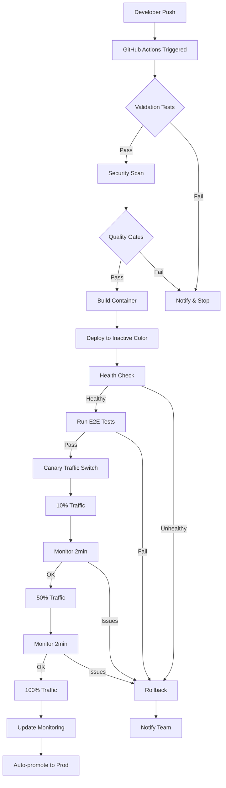

# 🚀 Complete CI/CD Automation System

## 📊 Overview

AI Square now has a **fully automated CI/CD pipeline** that requires zero manual intervention. Developers only need to:
1. Write features
2. Push to branch
3. System handles everything else automatically

## 🏗️ Architecture Components

### 1. **GitHub Actions Workflow** (`deploy-complete.yml`)
- Pre-deployment validation (TypeScript, ESLint, Tests)
- Security scanning (npm audit, TruffleHog, Trivy)
- Quality gates (coverage > 70%, build time < 5min)
- Blue-green deployment with canary rollout
- Automated E2E testing post-deployment
- Auto-rollback on failure
- Slack notifications

### 2. **Terraform Blue-Green Infrastructure**
- Zero-downtime deployments
- Automatic traffic switching
- Health checks before switching
- Emergency rollback capability
- Separate blue/green Cloud Run services

### 3. **Comprehensive Monitoring**
- Real-time dashboards
- SLO tracking (99.9% availability)
- Alert policies for:
  - High error rate (> 5%)
  - High latency (> 2s)
  - Service down
  - Database issues
  - Memory usage (> 80%)

## 🔄 Deployment Flow



## 🛡️ Safety Features

### Auto-Rollback Triggers
- E2E test failures
- Health check failures
- Error rate > 5%
- Response time > 2s
- Manual trigger available

### Quality Gates
- Test coverage must be > 70%
- Build time must be < 5 minutes
- No critical security vulnerabilities
- All TypeScript checks pass
- All ESLint rules pass

### Monitoring & Alerts
- Slack notifications for all events
- Email alerts for critical issues
- Dashboard for real-time monitoring
- SLO tracking and reporting

## 🚀 Usage

### Deploy to Staging
```bash
# Automatic on push to staging branch
git push origin feature-branch:staging

# Or manual trigger
gh workflow run deploy-complete.yml -f environment=staging
```

### Deploy to Production
```bash
# Automatic on push to main branch
git push origin main

# Or manual trigger
gh workflow run deploy-complete.yml -f environment=production
```

### Emergency Rollback
```bash
# Terraform approach
cd terraform
./scripts/rollback.sh

# Or via Cloud Console
gcloud run services update-traffic ai-square-production \
  --to-revisions=PREVIOUS_REVISION=100
```

### View Monitoring
```bash
# Get dashboard URL
cd terraform
terraform output dashboard_url

# Or direct link
https://console.cloud.google.com/monitoring/dashboards
```

## 🔧 Configuration

### Required Secrets (GitHub)
```yaml
GCP_SA_KEY: Service account JSON key
SLACK_WEBHOOK: Slack webhook URL
STAGING_DB_HOST: Staging database host
STAGING_DB_NAME: Staging database name
STAGING_DB_USER: Staging database user
STAGING_DB_PASSWORD: Staging database password
PROD_DB_HOST: Production database host
PROD_DB_NAME: Production database name
PROD_DB_USER: Production database user
PROD_DB_PASSWORD: Production database password
MONITORING_NOTIFICATION_CHANNEL: GCP notification channel ID
```

### Terraform Variables
```hcl
# terraform.tfvars
project_id = "ai-square-463013"
region = "asia-east1"
environment = "staging" # or "production"
db_password = "your-secure-password"
slack_webhook_url = "https://hooks.slack.com/..."
alert_email = "alerts@your-domain.com"
```

## 📊 Metrics & SLOs

### Service Level Objectives
- **Availability**: 99.9% (43.2 minutes downtime/month)
- **Latency**: 95th percentile < 2s
- **Error Rate**: < 1%

### Key Metrics Tracked
- Request count and rate
- Error count and rate
- Response time distribution
- Memory and CPU usage
- Database connections
- Cache hit rate

## 🔍 Troubleshooting

### Common Issues

1. **Deployment stuck at health check**
   - Check Cloud Run logs
   - Verify database connectivity
   - Check environment variables

2. **E2E tests failing**
   - Review Playwright report
   - Check for API changes
   - Verify test data

3. **High error rate after deployment**
   - Check application logs
   - Review recent changes
   - Rollback if necessary

### Debug Commands
```bash
# View deployment logs
gcloud run logs read --service=ai-square-staging --limit=50

# Check service status
gcloud run services describe ai-square-staging --region=asia-east1

# View monitoring alerts
gcloud alpha monitoring policies list

# Test health endpoint
curl https://ai-square-staging.run.app/api/health
```

## 🎯 Benefits Achieved

1. **Zero Manual Intervention**: Everything is automated
2. **Fast Feedback**: Know within minutes if deployment succeeded
3. **Safe Deployments**: Auto-rollback protects production
4. **Complete Visibility**: Real-time monitoring and alerts
5. **Developer Focus**: Only write code, system handles the rest

## 📈 Next Steps

The CI/CD system is now complete with:
- ✅ Automated testing
- ✅ Security scanning  
- ✅ Blue-green deployment
- ✅ Auto-rollback
- ✅ Monitoring & alerts
- ✅ Quality gates
- ✅ Auto-promotion

Developers can now focus purely on feature development while the system ensures safe, reliable deployments!