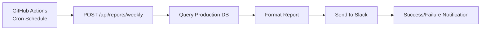

# Scheduled Jobs - 自動化任務

> **Updated**: 2025-12-09
>
> **管理方式**: GitHub Actions Scheduled Workflows

## 概覽

AI Square 使用 GitHub Actions 的 scheduled workflows 來執行定期自動化任務。所有 scheduled jobs 都透過 GitHub Actions 觸發，調用 Production Cloud Run API endpoints。

## 🔔 Weekly Report (週報自動發送)

### 基本資訊

- **功能**: 每週一自動生成並發送 AI Square 週報到 Slack
- **配置文件**: `.github/workflows/weekly-report.yml`
- **執行時間**: 每週一 09:00 Asia/Taipei (01:00 UTC)
- **API Endpoint**: `POST /api/reports/weekly`

### 運作方式



**流程說明**:
1. GitHub Actions 根據 cron schedule 每週一 01:00 UTC 觸發
2. 調用 Production API: `POST /api/reports/weekly`
3. API 從 Production Database 查詢上週統計資料
4. 格式化週報內容為 Slack markdown format
5. 透過 Slack Webhook 發送週報
6. 如果失敗，自動發送失敗通知到 Slack

### 必要配置

#### 1. GitHub Secret

```bash
# 檢查 secret 是否存在
gh secret list | grep SLACK_AISQUARE_WEBHOOK_URL

# 設定 secret (如需要)
gh secret set SLACK_AISQUARE_WEBHOOK_URL --body "https://hooks.slack.com/services/YOUR/WEBHOOK/URL"
```

#### 2. Cloud Run 環境變數

Production Cloud Run 服務必須配置 `SLACK_AISQUARE_WEBHOOK_URL` 環境變數：

```bash
# 驗證 production 服務配置
gcloud run services describe ai-square-production \
  --region=asia-east1 \
  --format="value(spec.template.spec.containers[0].env)" | grep SLACK

# 如需更新 (透過 GitHub Actions auto-deploy.yml 自動處理)
# 手動更新請參考 docs/deployment/CICD.md
```

### 手動觸發

```bash
# 方法 1: 透過 GitHub Actions 手動觸發 (推薦)
gh workflow run weekly-report.yml

# 方法 2: 直接調用 API (測試用)
curl -X POST https://ai-square-production-m7s4ucbgba-de.a.run.app/api/reports/weekly \
  -H "Content-Type: application/json"
```

### 本地測試

```bash
cd frontend

# Staging 環境測試 (不會發送到 Slack)
npm run report:weekly:dry

# Production 環境測試 (不會發送到 Slack，需要 .env.production)
npm run report:weekly:dry:prod
```

**測試腳本位置**:
- `scripts/test-weekly-report.ts` - Staging 測試
- `scripts/test-weekly-report-production.ts` - Production 測試

### 監控與除錯

#### 檢查 GitHub Actions 執行狀態

```bash
# 檢查最近的執行記錄
gh run list --workflow="Weekly Report" --limit 5

# 查看特定執行詳情
gh run view [RUN_ID]

# 檢查失敗日誌
gh run view [RUN_ID] --log-failed
```

#### 檢查 Cloud Run 日誌

```bash
# 查看週報相關日誌
gcloud run services logs read ai-square-production \
  --region=asia-east1 \
  --limit=50 | grep "weekly"

# 查看最近的錯誤
gcloud run services logs read ai-square-production \
  --region=asia-east1 \
  --limit=100 | grep -i error
```

#### 常見問題排查

**問題 1: 週報沒有發送**
```bash
# 1. 檢查 GitHub Actions 是否執行
gh run list --workflow="Weekly Report" --limit 1

# 2. 檢查 API 是否可達
curl -I https://ai-square-production-m7s4ucbgba-de.a.run.app/api/reports/weekly

# 3. 檢查環境變數
gcloud run services describe ai-square-production \
  --region=asia-east1 --format="yaml(spec.template.spec.containers[0].env)"
```

**問題 2: 資料不正確**
```bash
# 檢查 Database 連線
gcloud sql connect ai-square-db-production --user=postgres

# 執行統計查詢驗證
# 參考: frontend/src/app/api/reports/lib/db-queries.ts
```

**問題 3: Slack Webhook 失敗**
```bash
# 測試 Webhook URL
curl -X POST [WEBHOOK_URL] \
  -H "Content-Type: application/json" \
  -d '{"text":"Test message"}'
```

### 週報內容

週報包含以下統計資料 (基於上週完整一週 Monday-Sunday):

#### 📈 用戶增長
- 本週新註冊人數 (與上週對比百分比)
- 累計用戶總數
- 日均註冊人數
- 過去 7 天趨勢 (每日註冊數)

#### 👥 用戶活躍度
- 本週活躍用戶數 (活躍率)
- 日均活躍用戶數
- 7 日留存率

#### 📚 學習數據
- Assessment 完成次數
- PBL 完成次數
- Discovery 完成次數
- 總完成率
- 最受歡迎內容 Top 3

#### 🚀 系統健康
- API 成功率
- 平均響應時間
- 系統可用性
- 資料庫連線狀態

### 失敗處理

**自動通知機制**:
- 如果 API 調用失敗 (非 200 response)
- GitHub Actions 自動發送失敗通知到 Slack
- 包含錯誤訊息和 GitHub Actions logs 連結

**手動恢復流程**:
1. 檢查 GitHub Actions logs 找出失敗原因
2. 修復問題 (環境變數、API bug、Database 連線等)
3. 手動觸發 workflow: `gh workflow run weekly-report.yml`
4. 驗證週報成功發送到 Slack

### 相關文件與代碼

**API 實作**:
- `frontend/src/app/api/reports/weekly/route.ts` - API endpoint
- `frontend/src/app/api/reports/lib/db-queries.ts` - 統計查詢邏輯
- `frontend/src/app/api/reports/lib/report-formatter.ts` - 週報格式化
- `frontend/src/app/api/reports/lib/slack-client.ts` - Slack 整合

**測試**:
- `frontend/src/app/api/reports/weekly/__tests__/route.test.ts` - API 測試
- `frontend/scripts/test-weekly-report.ts` - Staging 測試腳本
- `frontend/scripts/test-weekly-report-production.ts` - Production 測試腳本

**GitHub Actions**:
- `.github/workflows/weekly-report.yml` - Scheduled workflow

---

## 🔧 新增 Scheduled Job 標準流程

如果需要新增其他自動化任務，請遵循以下步驟以確保一致性和可維護性。

### Step 1: 創建 GitHub Actions Workflow

```yaml
# .github/workflows/your-job.yml
name: Your Scheduled Job

on:
  schedule:
    # 使用 cron 語法設定執行時間
    # 範例: 每天 09:00 UTC = 17:00 Asia/Taipei
    - cron: '0 9 * * *'
  workflow_dispatch:  # 允許手動觸發 (必須)

jobs:
  run-job:
    runs-on: ubuntu-latest
    timeout-minutes: 10  # 根據任務設定合理的 timeout

    steps:
      - name: Execute Scheduled Task
        run: |
          curl -X POST https://ai-square-production-m7s4ucbgba-de.a.run.app/api/your-endpoint \
            -H "Content-Type: application/json" \
            -w "\nHTTP Status: %{http_code}\n" \
            --fail-with-body

      - name: Notify on Failure
        if: failure()
        run: |
          curl -X POST ${{ secrets.SLACK_AISQUARE_WEBHOOK_URL }} \
            -H "Content-Type: application/json" \
            -d '{
              "text": "⚠️ Your Job Failed\n\nPlease check GitHub Actions logs.",
              "mrkdwn": true
            }'
```

### Step 2: 實作 API Endpoint

```typescript
// frontend/src/app/api/your-endpoint/route.ts
import { NextRequest, NextResponse } from 'next/server';

export async function POST(_request: NextRequest) {
  try {
    // 1. 執行任務邏輯
    const result = await performTask();

    // 2. 發送通知 (如需要)
    await sendNotification(result);

    return NextResponse.json({
      success: true,
      message: 'Task completed successfully',
      result
    });
  } catch (error) {
    console.error('Error executing task:', error);
    return NextResponse.json(
      {
        success: false,
        error: error instanceof Error ? error.message : 'Unknown error'
      },
      { status: 500 }
    );
  }
}
```

### Step 3: 配置 Secrets (如需要)

```bash
# GitHub Secret
gh secret set YOUR_SECRET_NAME --body "secret-value"

# Cloud Run 環境變數會透過 GitHub Actions 自動部署
# 請確保在 .github/workflows/auto-deploy.yml 中添加環境變數
```

### Step 4: 本地測試

```bash
# 創建測試腳本
# frontend/scripts/test-your-job.ts

#!/usr/bin/env npx tsx
import dotenv from 'dotenv';

dotenv.config({ path: '.env.local' });

async function main() {
  console.log('Testing your job...');

  // 實作測試邏輯
  // 不發送實際通知

  console.log('✅ Test completed successfully!');
}

main();
```

```json
// 在 frontend/package.json 添加測試命令
{
  "scripts": {
    "test:your-job:dry": "npx tsx scripts/test-your-job.ts"
  }
}
```

### Step 5: 文件化

在本文件添加新 scheduled job 的說明，包含：
- 功能描述
- 執行時間
- 配置要求
- 手動觸發方式
- 本地測試方式
- 監控與除錯指南
- 相關代碼位置

### Step 6: 部署與測試

```bash
# 1. Commit workflow 文件
git add .github/workflows/your-job.yml
git commit -m "feat: add scheduled job for your-task"

# 2. Push 到 main (會觸發部署)
git push origin main

# 3. 等待部署完成後，手動測試
gh workflow run your-job.yml

# 4. 監控執行狀態
gh run list --workflow="Your Scheduled Job" --limit 1
gh run view [RUN_ID]

# 5. 驗證結果
# 檢查通知是否發送、資料是否正確等
```

---

## 📊 Scheduled Jobs 監控總覽

### 查看所有 Scheduled Workflows

```bash
# 列出所有 scheduled workflows
gh workflow list | grep -i schedule

# 查看最近執行的 scheduled jobs
gh run list --limit 10 | grep -E "(Weekly|Daily|Monthly)"
```

### 監控最佳實踐

1. **設定 Slack 失敗通知** - 所有 scheduled jobs 必須包含失敗通知
2. **合理的 Timeout** - 根據任務複雜度設定適當的 timeout
3. **允許手動觸發** - 必須包含 `workflow_dispatch` 以便手動測試
4. **本地測試腳本** - 提供 dry-run 模式以便本地測試
5. **記錄執行歷史** - 定期檢查 GitHub Actions logs

### Cron Schedule 參考

```yaml
# 每天 09:00 UTC (17:00 Asia/Taipei)
- cron: '0 9 * * *'

# 每週一 01:00 UTC (09:00 Asia/Taipei)
- cron: '0 1 * * 1'

# 每月 1 號 00:00 UTC (08:00 Asia/Taipei)
- cron: '0 0 1 * *'

# 每小時
- cron: '0 * * * *'

# 工作日 09:00 UTC (17:00 Asia/Taipei)
- cron: '0 9 * * 1-5'
```

**注意**: GitHub Actions cron schedules 使用 UTC 時區，需要手動轉換為 Asia/Taipei (+8 小時)

---

## 相關文件

- [CI/CD 部署指南](./CICD.md)
- [GitHub Actions Workflows](./.github/workflows/)
- [API Documentation](../../frontend/README.md)
- [Database Schema](../technical/database-schema.md)

---

**最後更新**: 2025-12-09
**維護者**: AI Square DevOps Team
