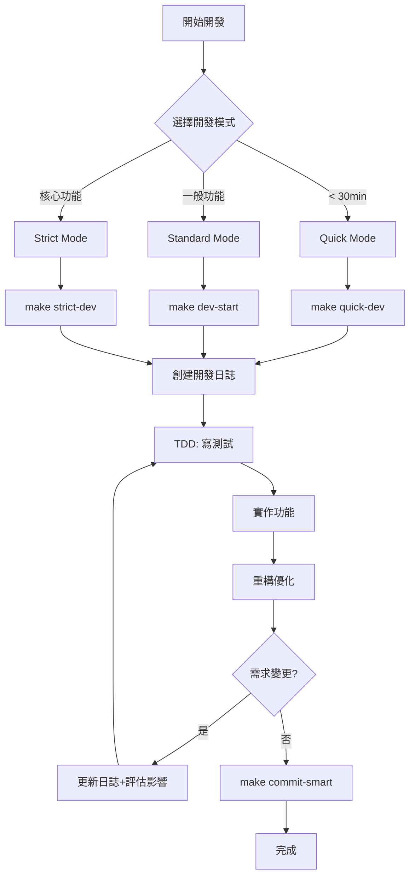

# AI Square 開發快速參考

## 🚀 開發流程一頁式指南



## 📋 快速命令

| 任務 | 命令 | 說明 |
|------|------|------|
| 開始開發 | `make dev-start` | 標準開發模式 |
| 繼續開發 | `make dev-continue` | 繼續未完成任務 |
| 智能提交 | `make commit-smart` | 自動檢查+提交 |
| 執行測試 | `npm test` | 運行所有測試 |
| 查看覆蓋率 | `npm test -- --coverage` | 測試覆蓋率報告 |

## 📁 關鍵目錄

```
/CLAUDE.md              # AI 知識庫（必須在根目錄）
docs/
├── PLAYBOOK.md        # 完整開發指南
├── quick-reference.md # 本檔案
├── dev-logs/          # 開發日誌
├── decisions/         # 架構決策 (ADR)
├── handbook/          # 📚 技術參考手冊
│   ├── frontend/      # 前端指南
│   ├── architecture/  # 架構設計
│   └── guides/        # 開發指南
└── stories/           # 📖 真實開發故事
    ├── features/      # 功能案例
    └── debugging/     # 調試案例
```

## ✅ 開發檢查清單

### 開發前
- [ ] 選擇適當的開發模式
- [ ] 創建開發日誌 (YAML)
- [ ] 查看相關 ADR

### 開發中
- [ ] TDD: 先寫測試
- [ ] 遵循前端架構標準 (ADR-004)
- [ ] 保持測試覆蓋率 ≥ 80%

### 提交前
- [ ] ESLint 通過
- [ ] TypeScript 無錯誤
- [ ] 所有測試通過
- [ ] 更新開發日誌狀態

## 🏗️ 架構速查

### 組件結構
```
components/
├── ui/       # Button, Card, Input
├── features/ # DomainCard, ProgressTracker
└── layouts/  # Header, Footer
```

### 狀態管理
1. **簡單**: `useState`
2. **複雜**: `useReducer`
3. **全域**: `Context + useReducer`
4. **伺服器**: `Custom Hooks`

### 測試策略
- 單元測試: 70-80%
- 整合測試: 15-25%
- E2E 測試: 5-10%

## 🔄 需求變更流程

1. 更新開發日誌
2. 評估影響（技術/產品）
3. 更新相關文檔
4. 保持測試覆蓋率

---
快速導航: [PLAYBOOK](PLAYBOOK.md) | [ADR](decisions/) | [教學](tutorials/)