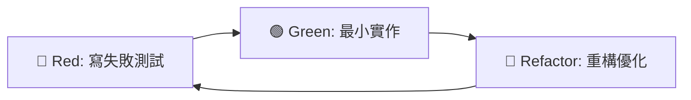

# 測試策略 - AI Square

## 🎯 測試理念

AI Square 採用**測試驅動開發 (TDD)** 和**行為驅動開發 (BDD)** 相結合的測試策略，確保產品品質和開發效率。

## 🏗️ 測試金字塔

```
         ┌─────────────────┐
         │   E2E Tests     │  ← 少量，高價值，慢速
         │   (5-10%)       │
    ┌────┴─────────────────┴────┐
    │   Integration Tests       │  ← 適量，API/服務整合
    │   (15-25%)                │
┌───┴────────────────────────────┴───┐
│        Unit Tests                  │  ← 大量，快速，專注邏輯
│        (70-80%)                    │
└────────────────────────────────────┘
```

## 🔬 測試層級策略

### 1. 單元測試 (Unit Tests) - 70-80%

#### 目標
- 驗證最小可測試單元的行為
- 快速反饋 (< 100ms per test)
- 高代碼覆蓋率 (> 90%)

#### 測試範圍
```typescript
// 純函數邏輯
describe('getTranslatedText', () => {
  it('should return Chinese text when lang is zh-TW', () => {
    const item = { description: 'Hello', description_zh: '你好' }
    const result = getTranslatedText('zh-TW', item, 'description')
    expect(result).toBe('你好')
  })
  
  it('should fallback to English when translation missing', () => {
    const item = { description: 'Hello' }
    const result = getTranslatedText('zh-TW', item, 'description')
    expect(result).toBe('Hello')
  })
})

// 組件邏輯
describe('LanguageSelector', () => {
  it('should save language preference to localStorage', () => {
    const { getByRole } = render(<LanguageSelector />)
    fireEvent.change(getByRole('combobox'), { target: { value: 'ja' } })
    expect(localStorage.getItem('ai-square-language')).toBe('ja')
  })
})

// 領域邏輯
describe('CompetencyEvaluationService', () => {
  it('should calculate correct competency level based on score', () => {
    const service = new CompetencyEvaluationService()
    const level = service.calculateLevel(85)
    expect(level).toBe(CompetencyLevel.Proficient)
  })
})
```

#### 工具鏈
- **Framework**: Jest + React Testing Library
- **Mocking**: jest.mock() + MSW
- **Coverage**: Istanbul (內建 Jest)
- **Assertions**: Jest Matchers + jest-dom

### 2. 整合測試 (Integration Tests) - 15-25%

#### 目標
- 驗證模組間協作行為
- 測試資料流和 API 契約
- 確保外部依賴整合正確

#### 測試範圍
```typescript
// API 路由測試
describe('/api/relations', () => {
  it('should return AI literacy data for valid language', async () => {
    const response = await request(app)
      .get('/api/relations?lang=zh-TW')
      .expect(200)
    
    expect(response.body).toHaveProperty('domains')
    expect(response.body.domains).toHaveLength(4)
    expect(response.body.domains[0]).toHaveProperty('overview')
  })
  
  it('should handle invalid language gracefully', async () => {
    const response = await request(app)
      .get('/api/relations?lang=invalid')
      .expect(200)
    
    // Should fallback to English
    expect(response.body.domains[0].overview).toMatch(/involves using AI/)
  })
})

// 資料庫整合
describe('UserRepository', () => {
  beforeEach(async () => {
    await setupTestDatabase()
  })
  
  it('should save and retrieve user preferences', async () => {
    const user = await userRepo.create({ email: 'test@example.com' })
    await userRepo.updatePreferences(user.id, { language: 'ja' })
    
    const retrieved = await userRepo.findById(user.id)
    expect(retrieved.preferences.language).toBe('ja')
  })
})

// 多語言系統整合
describe('I18n System Integration', () => {
  it('should load translations and render correctly', async () => {
    const { getByText } = render(<RelationsPage />, {
      wrapper: ({ children }) => (
        <I18nextProvider i18n={createTestI18n('zh-TW')}>
          {children}
        </I18nextProvider>
      )
    })
    
    await waitFor(() => {
      expect(getByText('與 AI 互動')).toBeInTheDocument()
    })
  })
})
```

#### 工具鏈
- **HTTP Testing**: Supertest
- **Database**: Test Containers / In-Memory DB
- **Mocking**: MSW (Mock Service Worker)
- **Environment**: Test-specific config

### 3. 端到端測試 (E2E Tests) - 5-10%

#### 目標
- 驗證關鍵用戶旅程
- 確保跨瀏覽器相容性
- 測試真實用戶場景

#### 測試範圍
```typescript
// 關鍵用戶流程
describe('AI Literacy Exploration Journey', () => {
  it('should allow user to explore competencies in their language', async () => {
    await page.goto('/relations')
    
    // 語言選擇
    await page.selectOption('[data-testid="language-selector"]', 'zh-TW')
    await page.waitForLoadState('networkidle')
    
    // 驗證中文介面
    await expect(page.locator('h1')).toContainText('AI 素養四大領域架構')
    
    // 展開領域
    await page.click('[data-testid="domain-engaging"]')
    await expect(page.locator('[data-testid="domain-overview"]')).toBeVisible()
    
    // 查看能力詳情
    await page.click('[data-testid="competency-e1"]')
    await expect(page.locator('[data-testid="ksa-section"]')).toBeVisible()
    
    // 點擊 KSA 代碼
    await page.click('[data-testid="knowledge-k1.4"]')
    await expect(page.locator('[data-testid="ksa-card"]')).toContainText('AI 的性質')
  })
})

// 多設備響應式測試
describe('Responsive Design', () => {
  it('should work correctly on mobile devices', async () => {
    await page.setViewportSize({ width: 375, height: 667 })
    await page.goto('/relations')
    
    // 手機版 KSA 卡片應該是覆蓋層
    await page.click('[data-testid="competency-e1"]')
    await page.click('[data-testid="knowledge-k1.4"]')
    await expect(page.locator('[data-testid="ksa-overlay"]')).toBeVisible()
  })
})

// 效能測試
describe('Performance', () => {
  it('should load initial page within 2 seconds', async () => {
    const startTime = Date.now()
    await page.goto('/relations')
    await page.waitForLoadState('networkidle')
    const loadTime = Date.now() - startTime
    
    expect(loadTime).toBeLessThan(2000)
  })
})
```

#### 工具鏈
- **Framework**: Playwright
- **Cross-Browser**: Chrome, Firefox, Safari
- **CI Integration**: GitHub Actions
- **Visual Testing**: Percy/Chromatic (選配)

## 🔄 TDD 工作流程

### Red-Green-Refactor 循環



### 實際範例：新增 Google 登入功能

#### 1. 🔴 Red Phase - 寫失敗測試
```typescript
// __tests__/auth/google-login.test.ts
describe('Google Login', () => {
  it('should redirect to Google OAuth when clicking Google login button', () => {
    render(<LoginPage />)
    const googleButton = screen.getByRole('button', { name: /sign in with google/i })
    
    fireEvent.click(googleButton)
    
    // 這個測試會失敗，因為功能還沒實作
    expect(mockRouter.push).toHaveBeenCalledWith(
      expect.stringContaining('accounts.google.com/oauth')
    )
  })
})
```

#### 2. 🟢 Green Phase - 最小實作
```typescript
// components/LoginPage.tsx
export default function LoginPage() {
  const router = useRouter()
  
  const handleGoogleLogin = () => {
    // 最小實作：直接重導向到 Google OAuth
    router.push('https://accounts.google.com/oauth/authorize?...')
  }
  
  return (
    <button onClick={handleGoogleLogin}>
      Sign in with Google
    </button>
  )
}
```

#### 3. 🔵 Refactor Phase - 重構優化
```typescript
// hooks/useAuth.ts  
export function useAuth() {
  const signInWithGoogle = useCallback(async () => {
    try {
      await signIn('google')
    } catch (error) {
      console.error('Google login failed:', error)
    }
  }, [])
  
  return { signInWithGoogle }
}

// components/LoginPage.tsx (重構後)
export default function LoginPage() {
  const { signInWithGoogle } = useAuth()
  
  return (
    <button 
      onClick={signInWithGoogle}
      className="google-login-button"
    >
      Sign in with Google
    </button>
  )
}
```

## 🧪 測試分類與標籤

### 測試標籤系統
```typescript
// Jest 設定
module.exports = {
  testMatch: [
    '**/__tests__/**/*.(test|spec).ts?(x)',
    '**/*.(test|spec).ts?(x)'
  ],
  testPathIgnorePatterns: [
    '/node_modules/',
    '/e2e/',
    '/integration/'
  ]
}

// 不同測試套件
// Unit tests: *.test.ts
// Integration tests: *.integration.test.ts  
// E2E tests: *.e2e.test.ts
```

### 測試運行策略
```bash
# 開發時：只跑單元測試 (快速回饋)
npm run test:unit

# 提交前：跑所有測試
npm run test:all

# CI：分階段執行
npm run test:unit     # Stage 1
npm run test:integration  # Stage 2  
npm run test:e2e      # Stage 3 (夜間或發布前)
```

## 📊 測試覆蓋率目標

### 覆蓋率門檻
```javascript
// jest.config.js
module.exports = {
  collectCoverageFrom: [
    'src/**/*.{ts,tsx}',
    '!src/**/*.d.ts',
    '!src/**/*.stories.tsx'
  ],
  coverageThreshold: {
    global: {
      branches: 80,
      functions: 80,
      lines: 80,
      statements: 80
    },
    // 關鍵模組更高標準
    './src/domain/': {
      branches: 90,
      functions: 90,
      lines: 90,
      statements: 90
    }
  }
}
```

### 關鍵模組優先級
1. **Critical (95%+)**: 認證、資料驗證、安全邏輯
2. **Important (90%+)**: 業務邏輯、API 層
3. **Standard (80%+)**: UI 組件、工具函數
4. **Acceptable (70%+)**: 配置、常數、類型定義

## 🚀 CI/CD 整合

### GitHub Actions 工作流程
```yaml
# .github/workflows/test.yml
name: Test Suite

on: [push, pull_request]

jobs:
  unit-tests:
    runs-on: ubuntu-latest
    steps:
      - uses: actions/checkout@v3
      - uses: actions/setup-node@v3
      - run: npm ci
      - run: npm run test:unit -- --coverage
      - uses: codecov/codecov-action@v3
  
  integration-tests:
    runs-on: ubuntu-latest
    needs: unit-tests
    steps:
      - uses: actions/checkout@v3
      - uses: actions/setup-node@v3
      - run: npm ci
      - run: npm run test:integration
  
  e2e-tests:
    runs-on: ubuntu-latest
    needs: [unit-tests, integration-tests]
    steps:
      - uses: actions/checkout@v3
      - uses: actions/setup-node@v3
      - run: npm ci
      - run: npm run build
      - run: npm run test:e2e
```

### 品質門檻
- ✅ 所有測試必須通過
- ✅ 覆蓋率不得低於設定門檻
- ✅ ESLint 無錯誤
- ✅ TypeScript 編譯成功
- ✅ Build 產出無問題

## 🔧 測試工具配置

### Jest 配置
```javascript
// jest.config.js
module.exports = {
  testEnvironment: 'jsdom',
  setupFilesAfterEnv: ['<rootDir>/src/test-setup.ts'],
  moduleNameMapping: {
    '^@/(.*)$': '<rootDir>/src/$1'
  },
  transform: {
    '^.+\\.(ts|tsx)$': 'ts-jest'
  },
  collectCoverageFrom: [
    'src/**/*.{ts,tsx}',
    '!src/**/*.d.ts'
  ]
}
```

### Testing Library 設定
```typescript
// src/test-setup.ts
import '@testing-library/jest-dom'
import { cleanup } from '@testing-library/react'
import { afterEach } from 'vitest'

// 每次測試後清理
afterEach(() => {
  cleanup()
})

// Mock localStorage
Object.defineProperty(window, 'localStorage', {
  value: {
    getItem: jest.fn(),
    setItem: jest.fn(),
    removeItem: jest.fn(),
    clear: jest.fn(),
  },
  writable: true,
})
```

## 🔍 TDD 合規檢查

### 自動化檢查工具
```bash
# 執行 TDD 合規檢查
make dev-tdd-check

# 強制檢查（有問題時失敗）
make dev-tdd-enforce
```

### 檢查項目
- **測試覆蓋率**: 確保達到最低門檻 80%
- **測試文件完整性**: 重要文件必須有對應測試
- **TDD 流程遵循**: 檢查是否先寫測試後實現
- **測試品質**: 測試命名和結構檢查

### 合規報告
- 報告位置: `docs/handbook/05-reports/tdd-compliance-report.md`
- JSON 資料: `docs/handbook/05-reports/tdd-compliance-report.json`
- 生成頻率: 每次執行 `make dev-tdd-check` 時更新

## 📈 測試指標與監控

### 關鍵指標
- **Test Success Rate**: > 99%
- **Test Execution Time**: < 10 minutes
- **Code Coverage**: > 80% overall
- **Flaky Test Rate**: < 1%
- **TDD Compliance Score**: > 80%

### 持續改善
- 每週檢視失敗測試
- 定期重構慢速測試
- 監控測試執行時間趨勢
- 分析覆蓋率變化
- 追蹤 TDD 合規性趨勢

---

> **測試文化**: 測試不是負擔，而是開發者的安全網和設計工具  
> **維護原則**: 測試程式碼和產品程式碼同等重要，需要同樣的品質標準