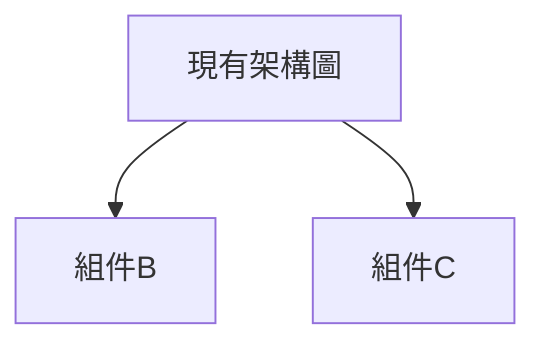
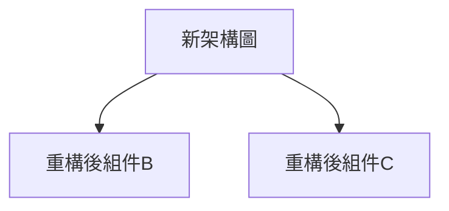

# 重構計劃：fix-dev-logs-accuracy

**創建日期**: 2025-06-24  
**重構ID**: fix-dev-logs-accuracy  
**優先級**: <!-- 高/中/低 -->  
**複雜度**: <!-- 高/中/低 -->

## 重構概述

### 重構目標
<!-- 為什麼要進行這次重構 -->

### 預期收益
- **技術收益**:
  - 程式碼品質提升
  - 維護性改善
  - 效能優化

- **業務收益**:
  - 開發效率提升
  - 功能擴展便利性
  - 風險降低

### 重構範圍
- **包含的模組**:
  - 模組1
  - 模組2

- **不包含的部分**:
  - 範圍外1
  - 範圍外2

## 現狀分析

### 現有架構

### 問題識別
1. **技術債務**:
   - 問題1：
   - 問題2：

2. **架構問題**:
   - 耦合度過高
   - 責任不清晰

3. **效能問題**:
   - 瓶頸點1
   - 瓶頸點2

### 品質指標
- **程式碼複雜度**: 
- **測試覆蓋率**: 
- **技術債務評分**: 

## 目標架構

### 新架構設計

### 設計原則
- 單一責任原則
- 開放封閉原則
- 依賴倒轉原則

### 技術選型
- **框架/函式庫**:
  - 選擇1：原因
  - 選擇2：原因

- **設計模式**:
  - 模式1：應用場景
  - 模式2：應用場景

## 實作策略

### 重構方法
- [ ] **大爆炸重構**: 一次性全部重寫
- [x] **漸進式重構**: 分階段逐步改善
- [ ] **並行重構**: 新舊系統並存

### 實作階段

#### 階段1：基礎重構 (預計 X 天)
- [ ] 任務1：
- [ ] 任務2：
- [ ] 任務3：

#### 階段2：核心重構 (預計 Y 天)
- [ ] 任務4：
- [ ] 任務5：
- [ ] 任務6：

#### 階段3：整合優化 (預計 Z 天)
- [ ] 任務7：
- [ ] 任務8：
- [ ] 任務9：

### 遷移策略
1. **向後兼容性保證**
2. **資料遷移計劃**
3. **API 版本控制**

## 風險管控

### 技術風險
| 風險 | 機率 | 影響 | 應對策略 |
|------|------|------|----------|
| 重構範圍擴散 | 中 | 高 | 嚴格控制範圍，分階段執行 |
| 引入新 Bug | 高 | 中 | 充分測試，程式碼審查 |
| 效能下降 | 低 | 高 | 效能基準測試，持續監控 |

### 業務風險
| 風險 | 機率 | 影響 | 應對策略 |
|------|------|------|----------|
| 開發進度延誤 | 中 | 中 | 預留緩衝時間，及時溝通 |
| 功能回歸 | 低 | 高 | 完整回歸測試 |

### 回滾計劃
- **回滾觸發條件**:
- **回滾步驟**:
- **回滾責任人**:

## 測試策略

### 測試類型
- [ ] **單元測試**: 覆蓋率目標 ≥ 85%
- [ ] **整合測試**: 關鍵路徑覆蓋
- [ ] **效能測試**: 基準比較
- [ ] **相容性測試**: API 相容性驗證

### 測試重點
1. **功能正確性**
2. **效能指標**
3. **相容性檢查**
4. **異常處理**

### 驗收標準
- [ ] 所有現有功能正常運作
- [ ] 效能指標達到預期
- [ ] 程式碼品質指標改善
- [ ] 沒有嚴重 Bug

## 品質保證

### 程式碼審查
- **審查重點**:
  - 架構合理性
  - 程式碼品質
  - 效能影響

### 品質指標
| 指標 | 重構前 | 目標值 | 重構後 |
|------|--------|--------|--------|
| 程式碼複雜度 | | | |
| 測試覆蓋率 | | | |
| 技術債務評分 | | | |

### 文件更新
- [ ] 架構文件
- [ ] API 文件
- [ ] 使用者文件
- [ ] 維護文件

## 時程安排

### 里程碑
- **M1**: 基礎重構完成 (2025-06-24)
- **M2**: 核心重構完成 (2025-06-24)
- **M3**: 整體重構完成 (2025-06-24)

### 資源安排
- **開發人員**: 
- **測試人員**: 
- **架構師**: 

## 成功指標

### 量化指標
- 程式碼複雜度降低 X%
- 測試覆蓋率提升到 Y%
- 建置時間減少 Z%

### 質化指標
- 開發體驗改善
- 維護成本降低
- 擴展性增強

---

**計劃制定**: AI + Human  
**技術負責人**: <!-- 待分配 -->  
**專案經理**: <!-- 待分配 -->  
**狀態**: 📋 規劃中