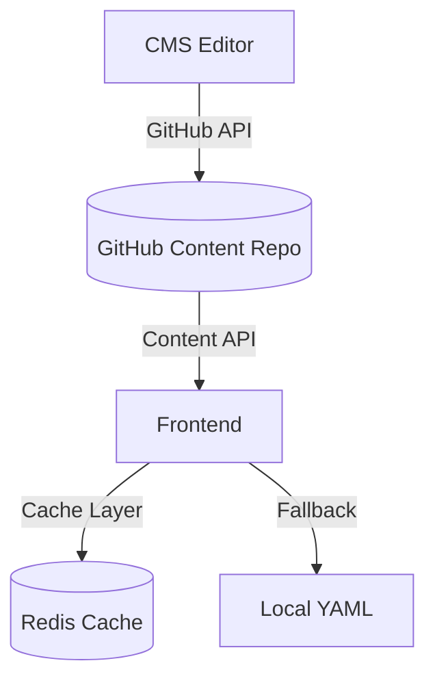

# Product Requirements Document (PRD) - AI Square

## 📋 Executive Summary

AI Square 是一個「用 AI 學 AI 素養」的創新學習平台，基於國際 AI Literacy 框架，透過 AI 技術本身來提升學習者的 AI 素養能力。

**願景**: 成為培養 21 世紀數位公民的教育基礎設施
**使命**: 讓每個人都能理解、應用並批判性思考 AI 技術
**當前階段**: Phase 2 Enhancement (2025 Q1)

## 🎯 Product Goals

### 主要目標
1. **教育核心**: 提供個人化、適應性的 AI 素養學習體驗
2. **技術創新**: 展示 AI 在教育領域的最佳實踐
3. **全球普及**: 支援 14 種語言，觸及全球學習者
4. **持續成長**: 建立可擴展的學習內容生態系統

### 成功指標
- 學習完成率 > 60%
- 用戶滿意度 > 4.5/5
- 月活躍用戶成長 > 20%
- 內容覆蓋率 > 90% (各語言版本)

## 🏗️ System Architecture

### 統一學習架構
```
Content Source → Scenario → Program → Task → Evaluation
```

### 三大學習模式
1. **PBL (Problem-Based Learning)**: 情境式問題解決
2. **Assessment**: 能力評估與診斷
3. **Discovery**: 職涯探索與技能發展

### 技術架構
- **Frontend**: Next.js 15, TypeScript, Tailwind CSS v4
- **Backend**: FastAPI, Python 3.x
- **AI Services**: Google Vertex AI, Claude API
- **Database**: PostgreSQL
- **Cache**: Redis (多層快取架構) ✅
  - L1: Memory Cache (500 items, TTL 5min)
  - L2: Redis Distributed Cache (TTL 1hr)
  - L3: Fallback Cache (in-memory backup)
  - SWR: Stale-While-Revalidate 背景更新
- **Storage**: Google Cloud Storage

## 🔄 Content Management Architecture (方案 C)

### 架構願景：內容與功能分離

#### 整體架構


### 實作階段

#### Phase 1: Content API Layer (Week 1)
建立動態內容 API，支援多語言、版本控制、快取策略

**核心功能**:
- RESTful Content API
- Multi-language support
- Redis caching integration
- Fallback to local files

**API 端點設計**:
```typescript
GET /api/content/[...path]?lang=en
GET /api/content/pbl/scenarios/{id}?lang=zhTW
GET /api/content/assessment/questions?lang=ja
GET /api/content/discovery/{career}?lang=ko
```

#### Phase 2: Content Service Abstraction (Week 1-2)
統一內容存取介面，隱藏實作細節

**服務架構**:
```typescript
ContentAPIService
├── getScenario(id, language)
├── getAssessmentQuestions(language)
├── getDiscoveryCareer(career, language)
└── getRubrics(domain, language)
```

#### Phase 3: CMS Enhancement (Week 2)
強化 CMS 功能，支援版本控制、內容驗證、發布流程

**核心功能**:
- Version control system
- Content validation
- Staging/Production publishing
- Cache invalidation hooks

#### Phase 4: Cache Strategy Optimization (Week 2-3) ✅
多層快取架構，提升內容載入效能

**已實作的快取層級**:
1. **L1 Memory Cache**: LRU, 500 items, TTL 5min ✅
2. **L2 Redis Cache**: Distributed, TTL 1hr ✅
3. **L3 Fallback Cache**: In-memory backup ✅
4. **SWR (Stale-While-Revalidate)**: 背景更新機制 ✅

**已完成的 API 快取整合**:
- ✅ `/api/relations` - KSA 框架資料（TTL: 1hr）
- ✅ `/api/discovery/scenarios` - Discovery 情境列表（TTL: 5min）
- ✅ `/api/assessment/scenarios` - Assessment 情境列表（TTL: 1hr）
- ✅ `/api/pbl/scenarios` - PBL 情境列表（TTL: 1hr）
- ✅ `/api/ksa` - KSA 框架完整資料（TTL: 24hr）

**Redis 快取覆蓋完成**: 所有主要靜態內容 API 都已加入快取機制

**快取策略原則**:
- 匿名用戶請求：使用快取
- 登入用戶請求：直接計算（個人化資料）
- 所有快取 API 加入 `X-Cache` header 顯示狀態（HIT/MISS/STALE）

#### Phase 5: Monitoring & Analytics (Week 3)
內容使用分析與效能監控

**監控指標**:
- Content load time (P50, P95, P99)
- Cache hit ratio (target > 90%)
- API availability (target 99.9%)
- Content update latency (< 5min)

### 遷移策略

#### Stage 1: Dual Mode (Current)
```typescript
// 環境變數控制
const content = process.env.USE_CMS_API
  ? await contentAPI.getContent(path)
  : await readLocalFile(path);
```

#### Stage 2: API First (1 month)
```typescript
// API 優先，本地備援
try {
  const content = await contentAPI.getContent(path);
} catch {
  const content = await readLocalFile(path);
}
```

#### Stage 3: API Only (3 months)
```typescript
// 完全 API 驅動
const content = await contentAPI.getContent(path);
```

### 預期效益

1. **內容管理集中化**
   - Single Source of Truth
   - 版本控制與審核
   - 多環境管理

2. **效能優化**
   - 快取命中率 > 90%
   - API 響應 < 100ms (P95)
   - 內容更新 < 5分鐘

3. **開發體驗提升**
   - 內容熱更新
   - A/B 測試支援
   - 個人化內容

4. **可擴展性**
   - 微服務架構
   - 動態語言包
   - 第三方 CMS 整合

## 🎓 Educational Core Features

### 現有功能
1. **KSA 三維度評估**: Knowledge, Skills, Attitudes
2. **多語言支援**: 14 種語言完整覆蓋
3. **AI 導師系統**: 個人化學習輔導
4. **學習歷程追蹤**: 完整的進度記錄

### 規劃中的教育核心功能

#### 1. 個人化學習路徑推薦系統
- 基於學習風格識別
- 動態難度調整
- 先備知識差異處理
- 預測最佳學習路徑

#### 2. 學習成效即時視覺化儀表板
- 能力成長軌跡圖
- 知識圖譜掌握度
- 學習效率分析
- 目標達成預測

#### 3. AI 學習夥伴深化
- 從導師到夥伴的角色轉換
- 記憶學習困難點
- 情緒支持系統
- 學習策略建議

#### 4. 跨模組學習歷程整合
- PBL → Discovery 職涯規劃
- Assessment → PBL 弱點強化
- Discovery → 個人化 Assessment

#### 5. 反思性學習日誌系統
- 每日學習反思
- 突破點記錄
- 困難概念追蹤
- 同儕回饋機制

## 📊 Quality Metrics

### 技術指標
- **測試覆蓋率**: 目標 80% (當前 76.59%)
- **TypeScript 錯誤**: 0
- **ESLint 警告**: 0
- **Build 時間**: < 30秒
- **API 響應時間**: < 500ms (P95)

### 教育指標
- **學習完成率**: > 60%
- **知識保留率**: > 70% (30天後)
- **應用能力**: > 50% (實作任務)
- **批判思考**: 質性評估

## 🚀 Development Roadmap

### Phase 1: Foundation (Completed ✅)
- ✅ 統一學習架構 (Content → Scenario → Program → Task → Evaluation)
- ✅ 基礎 CRUD 功能
- ✅ 多語言系統 (14 種語言)
- ✅ PostgreSQL 整合 (Schema v3)
- ✅ TypeScript 零錯誤

### Phase 2: Enhancement (Current 🚀) - Q1 2025
- ✅ Redis 快取優化 (多層快取架構)
- ✅ 測試覆蓋率提升 (76.59%)
- 🚧 Content API 架構 (進行中)
- 🚧 效能優化 (已達 5-10x 提升)
- 🚧 OAuth2 社交登入

### Phase 3: Intelligence (Q2 2025)
- 個人化推薦系統
- 學習分析儀表板
- AI 夥伴深化
- 反思日誌系統
- 智能 Onboarding

### Phase 4: Scale (Q3 2025)
- 企業版功能
- API 開放平台
- 第三方整合
- 全球部署
- SaaS 平台轉型

## 🔒 Security & Compliance

### 資料保護
- GDPR 合規
- 資料加密 (at rest & in transit)
- 定期安全審計
- 漏洞掃描

### 隱私保護
- 最小權限原則
- 資料匿名化
- 用戶控制權
- 透明度報告

## 📈 Success Criteria

### 短期目標 (Q1 2025)
- [x] 測試覆蓋率達 70%+ ✅ (76.59%)
- [x] TypeScript 零錯誤 ✅
- [x] Redis 快取整合 ✅
- [ ] Content API 上線
- [ ] OAuth2 登入系統

### 中期目標 (Q2 2025)
- [ ] 個人化系統上線
- [ ] 用戶數達 10,000
- [ ] 完成率達 60%
- [ ] 智能 Onboarding 上線

### 長期目標 (Q3-Q4 2025)
- [ ] 月活躍用戶 50,000
- [ ] 企業版推出
- [ ] API 生態系統
- [ ] 完成率達 70%

## 🤝 Stakeholders

- **學習者**: 終端用戶，需要有效的學習體驗
- **教育機構**: 採用平台的學校和組織
- **內容創作者**: 貢獻學習內容的專家
- **開發團隊**: 維護和改進平台
- **投資者**: 關注成長和影響力

## 📝 Appendix

### 技術債務清單
1. ~~PostgreSQL Repository 層重構~~ ✅
2. ~~測試覆蓋率提升至 90%~~ ✅ (當前 76.59%，核心模組已達標)
3. Monaco Editor 動態載入
4. ~~API 效能優化~~ ✅ (Redis 快取已實作)
5. **新增**: 補充剩餘 API 的 Redis 快取整合

### 風險評估
- **技術風險**: AI API 成本控制
- **市場風險**: 競爭對手進入
- **營運風險**: 內容品質維護
- **法規風險**: 各國教育法規差異

---

*Last Updated: 2025-08-12*
*Version: 2.3*
*Status: Active Development - Phase 2*

### 最新更新
- 2025-08-12 v2.3: 更新專案狀態至 Phase 2，調整目標時程為季度制
- 2025-08-11 v2.2: 完成所有主要 API 的 Redis 快取整合（KSA API 加入 24hr TTL）
- 2025-08-11 v2.1: 新增 Redis 快取實作狀態與待補充 API 清單
