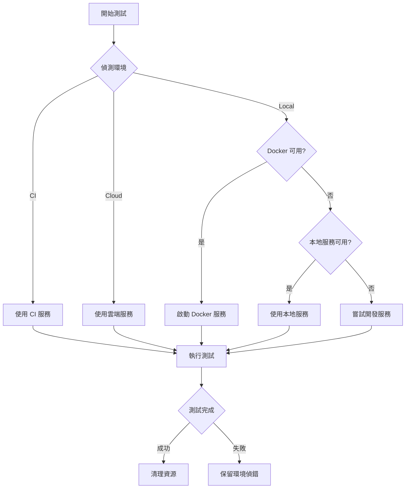

# Integration Test Architecture

## 🎯 設計理念

這個整合測試架構設計為**環境無關 (Environment Agnostic)**，可以在以下環境無縫運行：

1. **本地開發** - 使用 Docker 或本地服務
2. **GitHub Actions** - 使用 service containers
3. **Google Cloud Build** - 使用 Cloud SQL 和 Memorystore
4. **其他 CI/CD** - 自動偵測並配置

## 🏗️ 架構優點

### 1. 智能環境偵測
```typescript
// 自動偵測環境類型
const envType = detectEnvironment(); // 'local' | 'docker' | 'ci' | 'cloud'
```

### 2. 服務彈性配置
- **優先順序**: Docker → 本地服務 → 開發服務
- **自動 Fallback**: 如果測試服務不可用，會嘗試使用開發服務
- **健康檢查**: 確保服務就緒才開始測試

### 3. 隔離的測試環境
```yaml
測試環境:        開發環境:
Next.js: 3456    Next.js: 3000
PostgreSQL: 5434 PostgreSQL: 5433
Redis: 6380      Redis: 6379
```

## 📋 使用方式對照表

| 環境 | 指令 | 服務來源 | 配置方式 |
|------|------|----------|----------|
| **本地 (Docker)** | `npm run test:integration` | docker-compose.test.yml | 自動 |
| **本地 (Native)** | `./scripts/run-integration-tests.sh` | 本地 PostgreSQL/Redis | 自動 |
| **GitHub Actions** | 自動觸發 | Service containers | workflow 檔案 |
| **Cloud Build** | `gcloud builds submit` | Cloud SQL/Memorystore | 環境變數 |
| **手動測試** | `npm run test:integration:level-1` | 任何可用服務 | .env.test |

## 🔄 執行流程



## 🚀 快速開始

### 最簡單的方式
```bash
# 自動處理一切
./scripts/run-integration-tests.sh
```

### Docker 方式
```bash
# 啟動服務
docker-compose -f docker-compose.test.yml up -d

# 執行測試
npm run test:integration

# 停止服務
docker-compose -f docker-compose.test.yml down
```

### CI/CD 配置

#### GitHub Actions
```yaml
# .github/workflows/integration-test.yml
services:
  postgres:
    image: postgres:15-alpine
    ports: ["5434:5432"]
  redis:
    image: redis:7-alpine
    ports: ["6380:6379"]
```

#### Google Cloud Build
```yaml
# cloudbuild.yaml
steps:
  - name: 'gcr.io/cloud-builders/npm'
    args: ['run', 'test:integration']
    env:
      - 'DATABASE_URL=${_DATABASE_URL}'
      - 'REDIS_HOST=${_REDIS_HOST}'
```

## 🔧 環境變數優先順序

1. **命令列參數** (最高優先)
   ```bash
   TEST_PORT=4000 npm run test:integration
   ```

2. **.env.test** (專案配置)
   ```env
   TEST_PORT=3456
   ```

3. **環境預設值** (自動偵測)
   ```typescript
   const port = process.env.TEST_PORT || detectDefaultPort();
   ```

## 📊 測試層級

### Level 1: 基礎測試 (最快)
- 健康檢查
- API 可用性
- 資料庫連線

### Level 2: 簡單流程 (中等)
- CRUD 操作
- 認證流程
- 基本業務邏輯

### Level 3: 進階場景 (最慢)
- 端到端流程
- 效能測試
- 並發測試

## 🎯 最佳實踐

### 1. 環境隔離
```typescript
// 使用不同的資料庫名稱
const dbName = process.env.NODE_ENV === 'test' 
  ? 'ai_square_test' 
  : 'ai_square_db';
```

### 2. 資料清理
```typescript
afterEach(async () => {
  // 清理測試資料
  await db.query('DELETE FROM users WHERE email LIKE "%@test.com"');
});
```

### 3. 服務健康檢查
```typescript
beforeAll(async () => {
  // 等待服務就緒
  await waitForService(postgresConfig, 'postgres');
  await waitForService(redisConfig, 'redis');
});
```

### 4. 超時配置
```typescript
// 整合測試需要更長的超時
jest.setTimeout(30000); // 30 秒
```

## 🚨 常見問題

### Q: 為什麼使用不同的 port？
**A:** 避免與開發環境衝突，可以同時執行開發和測試。

### Q: Docker 不可用怎麼辦？
**A:** 腳本會自動 fallback 到本地服務或開發服務。

### Q: 如何在 CI 中使用？
**A:** CI 環境會自動偵測 (CI=true)，使用預配置的服務。

### Q: 測試很慢怎麼辦？
**A:** 
1. 只執行特定層級: `npm run test:integration:level-1`
2. 使用記憶體資料庫: `tmpfs` in Docker
3. 並行執行獨立測試

### Q: 如何偵錯失敗的測試？
**A:**
```bash
# 保持服務運行
KEEP_SERVICES=true npm run test:integration

# 手動連接資料庫偵錯
psql -h localhost -p 5434 -U postgres -d ai_square_db
```

## 📈 效能優化

1. **使用 tmpfs** (Docker)
   ```yaml
   tmpfs:
     - /var/lib/postgresql/data
   ```

2. **關閉持久化** (Redis)
   ```yaml
   command: redis-server --appendonly no --save ""
   ```

3. **並行執行** (Jest)
   ```javascript
   maxWorkers: 4 // 對於獨立的測試
   ```

4. **選擇性執行**
   ```bash
   # 只測試變更的檔案
   npm run test:integration -- --changedSince=main
   ```

## 🔐 安全性考量

1. **不要使用生產資料庫**
2. **使用專用的測試認證**
3. **隔離測試網路** (Docker networks)
4. **清理敏感資料**

## 🎉 總結

這個架構提供了：
- ✅ **環境彈性** - 任何地方都能執行
- ✅ **自動配置** - 智能偵測和設定
- ✅ **隔離安全** - 不影響開發環境
- ✅ **易於擴展** - 簡單新增測試
- ✅ **CI/CD 友好** - 原生支援各種平台