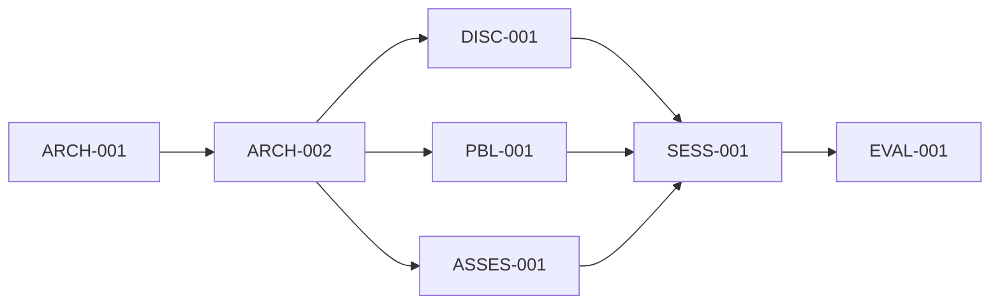

# /task - 架構重構任務追蹤器

## 任務管理總覽

使用任務管理系統追蹤跨 session 的重構工作，確保所有工作項目都被妥善管理和完成。

## 1. 任務層級結構

```
Epic: AI Square 架構重構
├── Story 1: 基礎設施建設
│   ├── Task 1.1: Storage 抽象層
│   ├── Task 1.2: Repository 模式
│   └── Task 1.3: 基礎服務
├── Story 2: Data Layer 重構
│   ├── Task 2.1: Discovery 模組
│   ├── Task 2.2: PBL 模組
│   └── Task 2.3: Assessment 模組
├── Story 3: Session 統一
│   ├── Task 3.1: BaseSession 實作
│   ├── Task 3.2: Session 管理
│   └── Task 3.3: UI 更新
└── Story 4: 評估系統整合
    ├── Task 4.1: 統一評估服務
    └── Task 4.2: 能力追蹤系統
```

## 2. Sprint 規劃

### Sprint 1 (Week 1-2): 基礎建設
```yaml
sprint_goal: "建立重構所需的基礎設施"
capacity: 80 hours
tasks:
  - id: ARCH-001
    title: "實作 Storage Provider 介面"
    points: 8
    assignee: developer1
    status: not_started
    
  - id: ARCH-002
    title: "建立 Repository 基礎類別"
    points: 13
    assignee: developer2
    status: not_started
    
  - id: ARCH-003
    title: "實作快取服務"
    points: 5
    assignee: developer1
    status: not_started
```

### Sprint 2 (Week 3-4): Discovery 重構
```yaml
sprint_goal: "完成 Discovery 模組的 Data Layer 重構"
capacity: 80 hours
tasks:
  - id: DISC-001
    title: "拆分 UserDataService"
    points: 13
    assignee: developer1
    dependencies: [ARCH-001, ARCH-002]
    status: not_started
    
  - id: DISC-002
    title: "實作 Discovery Repositories"
    points: 8
    assignee: developer2
    dependencies: [DISC-001]
    status: not_started
    
  - id: DISC-003
    title: "更新 Discovery Hooks"
    points: 5
    assignee: developer1
    dependencies: [DISC-002]
    status: not_started
```

## 3. 任務詳細定義

### Task Template
```typescript
interface Task {
  id: string;
  title: string;
  description: string;
  acceptanceCriteria: string[];
  storyPoints: number;
  priority: 'critical' | 'high' | 'medium' | 'low';
  status: TaskStatus;
  assignee?: string;
  dependencies: string[];
  subtasks: Subtask[];
  timeTracking: {
    estimated: number;
    spent: number;
    remaining: number;
  };
}
```

### 詳細任務範例

#### ARCH-001: 實作 Storage Provider 介面
```yaml
id: ARCH-001
title: "實作 Storage Provider 介面"
description: |
  建立統一的儲存抽象層，支援 localStorage、GCS 和未來的資料庫。
  
acceptance_criteria:
  - IStorageProvider 介面定義完整
  - LocalStorageProvider 實作並測試
  - GCSStorageProvider 實作並測試
  - 100% 單元測試覆蓋
  - 效能測試通過

subtasks:
  - title: "定義 IStorageProvider 介面"
    estimated_hours: 2
    checklist:
      - [ ] get 方法
      - [ ] set 方法
      - [ ] delete 方法
      - [ ] list 方法
      - [ ] batch 操作
      
  - title: "實作 LocalStorageProvider"
    estimated_hours: 4
    checklist:
      - [ ] 基本 CRUD
      - [ ] 錯誤處理
      - [ ] 序列化/反序列化
      - [ ] 容量管理
      
  - title: "實作 GCSStorageProvider"
    estimated_hours: 6
    checklist:
      - [ ] GCS 客戶端設置
      - [ ] 基本 CRUD
      - [ ] 錯誤處理
      - [ ] 重試機制

definition_of_done:
  - [ ] 程式碼完成
  - [ ] 單元測試通過
  - [ ] Code review 通過
  - [ ] 文檔更新
  - [ ] 整合測試通過
```

## 4. 依賴關係管理

### 4.1 關鍵路徑


### 4.2 依賴矩陣
| Task | Depends On | Blocks |
|------|------------|--------|
| ARCH-001 | - | ARCH-002, all repos |
| ARCH-002 | ARCH-001 | All module refactoring |
| DISC-001 | ARCH-002 | DISC-002, DISC-003 |
| SESS-001 | All modules | EVAL-001 |

## 5. 進度追蹤

### 5.1 燃盡圖 (Burndown Chart)
```
Story Points Remaining
│
80 ├─┐
   │ └─┐
60 ├   └─┐
   │     └─┐ (Ideal)
40 ├       └─┐
   │         └─┐
20 ├           └─┐
   │             └─┐
 0 └─┴─┴─┴─┴─┴─┴─┴─┴─┴─┴─
   1 2 3 4 5 6 7 8 9 10
        Weeks
```

### 5.2 進度儀表板
```typescript
interface ProgressDashboard {
  overall: {
    totalTasks: 45;
    completed: 0;
    inProgress: 0;
    blocked: 0;
    notStarted: 45;
  };
  
  byPhase: {
    infrastructure: { progress: 0, status: 'not_started' };
    dataLayer: { progress: 0, status: 'not_started' };
    session: { progress: 0, status: 'not_started' };
    evaluation: { progress: 0, status: 'not_started' };
  };
  
  velocity: {
    planned: 20; // points per sprint
    actual: 0;
    trend: 'stable';
  };
}
```

## 6. 風險與阻礙追蹤

### 6.1 風險登記冊
| Risk ID | Description | Probability | Impact | Mitigation | Owner |
|---------|-------------|-------------|---------|------------|-------|
| R001 | Data migration complexity | High | High | Incremental migration | Tech Lead |
| R002 | Breaking changes | Medium | High | Feature flags | Dev Team |
| R003 | Performance regression | Low | Medium | Performance tests | QA |

### 6.2 阻礙日誌
```yaml
blockers:
  - id: B001
    task: DISC-002
    description: "Waiting for storage interface finalization"
    blocked_since: "2025-01-10"
    resolution: "Prioritize ARCH-001 completion"
    
  - id: B002
    task: SESS-003
    description: "UI design not finalized"
    blocked_since: "2025-01-12"
    resolution: "Schedule design review meeting"
```

## 7. 團隊協作

### 7.1 責任分配矩陣 (RACI)
| Task | Dev1 | Dev2 | Tech Lead | QA | Product |
|------|------|------|-----------|-----|---------|
| Architecture | R | C | A | I | I |
| Implementation | A/R | A/R | C | I | I |
| Testing | C | C | I | A/R | I |
| Documentation | R | R | A | C | C |

*R=Responsible, A=Accountable, C=Consulted, I=Informed*

### 7.2 溝通計劃
```yaml
meetings:
  daily_standup:
    time: "09:00"
    duration: "15 min"
    format: "What I did, What I'll do, Blockers"
    
  sprint_planning:
    frequency: "Bi-weekly"
    duration: "2 hours"
    participants: ["Dev Team", "Tech Lead", "Product"]
    
  technical_review:
    frequency: "Weekly"
    duration: "1 hour"
    topics: ["Architecture decisions", "Code quality", "Technical debt"]
```

## 8. 品質保證檢查點

### 8.1 Code Review Checklist
- [ ] 遵循設計模式
- [ ] 適當的錯誤處理
- [ ] 充分的測試覆蓋
- [ ] 清晰的命名
- [ ] 效能考量
- [ ] 安全性檢查

### 8.2 測試策略
```typescript
interface TestStrategy {
  unit: {
    coverage: '>90%',
    framework: 'Jest',
    mockStrategy: 'Dependency injection'
  };
  
  integration: {
    coverage: '>80%',
    framework: 'Jest + Supertest',
    testDatabase: 'In-memory'
  };
  
  e2e: {
    coverage: 'Critical paths',
    framework: 'Playwright',
    environments: ['Chrome', 'Safari', 'Firefox']
  };
}
```

## 9. 知識管理

### 9.1 文檔需求
- [ ] 架構決策記錄 (ADR)
- [ ] API 文檔
- [ ] 開發者指南
- [ ] 遷移指南
- [ ] 故障排除指南

### 9.2 知識分享
```yaml
knowledge_sharing:
  tech_talks:
    - topic: "New Architecture Overview"
      date: "Week 2"
      presenter: "Tech Lead"
      
    - topic: "Repository Pattern Deep Dive"
      date: "Week 3"
      presenter: "Dev1"
      
  documentation_reviews:
    frequency: "Weekly"
    reviewers: ["Tech Lead", "Senior Dev"]
```

## 10. 完成標準

### 10.1 Definition of Done (DoD)
```yaml
definition_of_done:
  code:
    - All acceptance criteria met
    - Code reviewed and approved
    - Unit tests written and passing
    - Integration tests passing
    - No critical bugs
    
  documentation:
    - Technical documentation updated
    - API documentation current
    - User guide updated (if needed)
    
  deployment:
    - Deployed to staging
    - Smoke tests passing
    - Performance benchmarks met
    - Security scan passed
```

### 10.2 Sprint Success Criteria
- [ ] 90% of committed stories completed
- [ ] No critical bugs in production
- [ ] Technical debt not increased
- [ ] Team velocity maintained or improved

## 總結

這個任務管理系統確保重構工作有序進行，所有相關人員都清楚目前進度和下一步工作。透過持續追蹤和調整，我們可以確保專案成功完成。