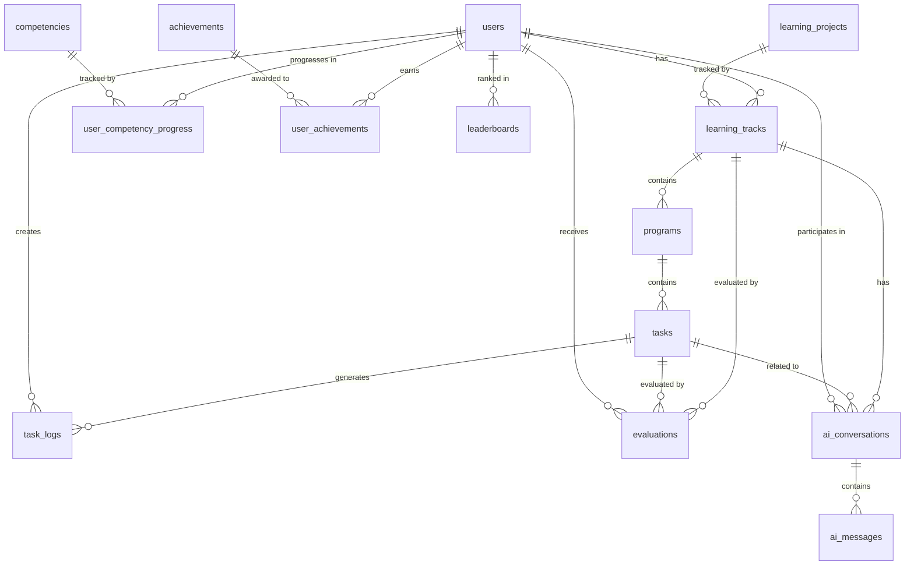

# 關聯式資料庫 Schema 設計

## 概述

本文檔定義 AI Square 的關聯式資料庫架構，採用正規化設計原則，確保資料一致性和完整性。

## 資料庫設計原則

1. **正規化**: 至少達到第三正規化 (3NF)
2. **主鍵設計**: 使用 UUID 作為主鍵，確保全域唯一性
3. **外鍵約束**: 建立明確的外鍵關係，維護參照完整性
4. **索引策略**: 在外鍵和常用查詢欄位建立索引
5. **時間戳記**: 所有表格包含 created_at 和 updated_at
6. **軟刪除**: 使用 deleted_at 實現軟刪除功能

## 核心資料表設計

### 1. 用戶相關表格

#### users 表
```sql
CREATE TABLE users (
    id UUID PRIMARY KEY DEFAULT gen_random_uuid(),
    email VARCHAR(255) UNIQUE NOT NULL,
    name VARCHAR(255) NOT NULL,
    avatar_url TEXT,
    auth_provider VARCHAR(50) NOT NULL, -- 'google', 'github', 'email'
    auth_provider_id VARCHAR(255),
    preferred_language VARCHAR(10) DEFAULT 'en',
    created_at TIMESTAMP WITH TIME ZONE DEFAULT CURRENT_TIMESTAMP,
    updated_at TIMESTAMP WITH TIME ZONE DEFAULT CURRENT_TIMESTAMP,
    deleted_at TIMESTAMP WITH TIME ZONE,
    UNIQUE(auth_provider, auth_provider_id)
);

CREATE INDEX idx_users_email ON users(email);
CREATE INDEX idx_users_auth_provider ON users(auth_provider, auth_provider_id);
```

### 2. 學習專案相關表格

#### learning_projects 表
```sql
CREATE TABLE learning_projects (
    id UUID PRIMARY KEY DEFAULT gen_random_uuid(),
    type VARCHAR(50) NOT NULL, -- 'assessment', 'pbl', 'discovery', 'chat'
    code VARCHAR(100) UNIQUE NOT NULL,
    title VARCHAR(500) NOT NULL,
    description TEXT,
    prerequisites JSONB, -- Array of prerequisite project IDs
    metadata JSONB, -- Additional project metadata
    is_active BOOLEAN DEFAULT true,
    created_at TIMESTAMP WITH TIME ZONE DEFAULT CURRENT_TIMESTAMP,
    updated_at TIMESTAMP WITH TIME ZONE DEFAULT CURRENT_TIMESTAMP,
    deleted_at TIMESTAMP WITH TIME ZONE
);

CREATE INDEX idx_learning_projects_type ON learning_projects(type);
CREATE INDEX idx_learning_projects_code ON learning_projects(code);
```

### 3. 學習軌跡相關表格

#### learning_tracks 表
```sql
CREATE TABLE learning_tracks (
    id UUID PRIMARY KEY DEFAULT gen_random_uuid(),
    user_id UUID NOT NULL REFERENCES users(id) ON DELETE CASCADE,
    project_id UUID NOT NULL REFERENCES learning_projects(id) ON DELETE CASCADE,
    type VARCHAR(50) NOT NULL, -- 'assessment', 'pbl', 'discovery', 'chat'
    status VARCHAR(50) NOT NULL DEFAULT 'created', -- 'created', 'active', 'paused', 'completed', 'abandoned'
    metadata JSONB, -- Track-specific metadata
    started_at TIMESTAMP WITH TIME ZONE,
    completed_at TIMESTAMP WITH TIME ZONE,
    last_active_at TIMESTAMP WITH TIME ZONE,
    created_at TIMESTAMP WITH TIME ZONE DEFAULT CURRENT_TIMESTAMP,
    updated_at TIMESTAMP WITH TIME ZONE DEFAULT CURRENT_TIMESTAMP,
    deleted_at TIMESTAMP WITH TIME ZONE,
    CONSTRAINT unique_active_track UNIQUE(user_id, project_id, status) WHERE status IN ('active', 'paused')
);

CREATE INDEX idx_learning_tracks_user_id ON learning_tracks(user_id);
CREATE INDEX idx_learning_tracks_project_id ON learning_tracks(project_id);
CREATE INDEX idx_learning_tracks_status ON learning_tracks(status);
CREATE INDEX idx_learning_tracks_type ON learning_tracks(type);
```

#### programs 表
```sql
CREATE TABLE programs (
    id UUID PRIMARY KEY DEFAULT gen_random_uuid(),
    track_id UUID NOT NULL REFERENCES learning_tracks(id) ON DELETE CASCADE,
    title VARCHAR(500) NOT NULL,
    description TEXT,
    program_order INTEGER NOT NULL,
    status VARCHAR(50) NOT NULL DEFAULT 'pending', -- 'pending', 'active', 'completed', 'skipped'
    config JSONB, -- Program-specific configuration
    started_at TIMESTAMP WITH TIME ZONE,
    completed_at TIMESTAMP WITH TIME ZONE,
    created_at TIMESTAMP WITH TIME ZONE DEFAULT CURRENT_TIMESTAMP,
    updated_at TIMESTAMP WITH TIME ZONE DEFAULT CURRENT_TIMESTAMP,
    CONSTRAINT unique_program_order UNIQUE(track_id, program_order)
);

CREATE INDEX idx_programs_track_id ON programs(track_id);
CREATE INDEX idx_programs_status ON programs(status);
```

#### tasks 表
```sql
CREATE TABLE tasks (
    id UUID PRIMARY KEY DEFAULT gen_random_uuid(),
    program_id UUID NOT NULL REFERENCES programs(id) ON DELETE CASCADE,
    title VARCHAR(500) NOT NULL,
    description TEXT,
    task_order INTEGER NOT NULL,
    type VARCHAR(50) NOT NULL, -- 'quiz', 'coding', 'discussion', 'submission', 'peer_review'
    required_ksa TEXT[], -- Array of required competency codes
    config JSONB, -- Task-specific configuration (questions, rubrics, etc.)
    status VARCHAR(50) NOT NULL DEFAULT 'pending', -- 'pending', 'active', 'completed', 'skipped'
    started_at TIMESTAMP WITH TIME ZONE,
    completed_at TIMESTAMP WITH TIME ZONE,
    created_at TIMESTAMP WITH TIME ZONE DEFAULT CURRENT_TIMESTAMP,
    updated_at TIMESTAMP WITH TIME ZONE DEFAULT CURRENT_TIMESTAMP,
    CONSTRAINT unique_task_order UNIQUE(program_id, task_order)
);

CREATE INDEX idx_tasks_program_id ON tasks(program_id);
CREATE INDEX idx_tasks_status ON tasks(status);
CREATE INDEX idx_tasks_type ON tasks(type);
```

#### task_logs 表
```sql
CREATE TABLE task_logs (
    id UUID PRIMARY KEY DEFAULT gen_random_uuid(),
    task_id UUID NOT NULL REFERENCES tasks(id) ON DELETE CASCADE,
    user_id UUID NOT NULL REFERENCES users(id) ON DELETE CASCADE,
    log_type VARCHAR(50) NOT NULL, -- 'attempt', 'submission', 'interaction', 'feedback', 'hint_used'
    data JSONB NOT NULL, -- Log-specific data
    duration_seconds INTEGER, -- Time spent on this action
    created_at TIMESTAMP WITH TIME ZONE DEFAULT CURRENT_TIMESTAMP
);

CREATE INDEX idx_task_logs_task_id ON task_logs(task_id);
CREATE INDEX idx_task_logs_user_id ON task_logs(user_id);
CREATE INDEX idx_task_logs_type ON task_logs(log_type);
CREATE INDEX idx_task_logs_created_at ON task_logs(created_at);
```

### 4. 評估相關表格

#### evaluations 表
```sql
CREATE TABLE evaluations (
    id UUID PRIMARY KEY DEFAULT gen_random_uuid(),
    track_id UUID NOT NULL REFERENCES learning_tracks(id) ON DELETE CASCADE,
    task_id UUID REFERENCES tasks(id) ON DELETE CASCADE, -- Optional, for task-level evaluations
    user_id UUID NOT NULL REFERENCES users(id) ON DELETE CASCADE,
    evaluation_type VARCHAR(50) NOT NULL, -- 'quiz', 'rubric', 'ai', 'peer', 'self'
    input JSONB NOT NULL, -- Evaluation input data
    result JSONB NOT NULL, -- Evaluation result including scores
    feedback JSONB, -- Generated feedback
    evaluated_by VARCHAR(50), -- 'system', 'ai', 'peer:{user_id}', 'self'
    created_at TIMESTAMP WITH TIME ZONE DEFAULT CURRENT_TIMESTAMP
);

CREATE INDEX idx_evaluations_track_id ON evaluations(track_id);
CREATE INDEX idx_evaluations_task_id ON evaluations(task_id);
CREATE INDEX idx_evaluations_user_id ON evaluations(user_id);
CREATE INDEX idx_evaluations_type ON evaluations(evaluation_type);
```

### 5. 能力相關表格

#### competencies 表 (Reference table)
```sql
CREATE TABLE competencies (
    id UUID PRIMARY KEY DEFAULT gen_random_uuid(),
    ksa_code VARCHAR(20) UNIQUE NOT NULL, -- 'K001', 'S002', 'A003'
    domain VARCHAR(100) NOT NULL, -- 'Engaging_with_AI', 'Creating_with_AI', etc.
    name VARCHAR(255) NOT NULL,
    description TEXT,
    category CHAR(1) NOT NULL CHECK (category IN ('K', 'S', 'A')), -- Knowledge, Skills, Attitudes
    level INTEGER NOT NULL DEFAULT 1, -- Competency level/difficulty
    created_at TIMESTAMP WITH TIME ZONE DEFAULT CURRENT_TIMESTAMP,
    updated_at TIMESTAMP WITH TIME ZONE DEFAULT CURRENT_TIMESTAMP
);

CREATE INDEX idx_competencies_ksa_code ON competencies(ksa_code);
CREATE INDEX idx_competencies_domain ON competencies(domain);
CREATE INDEX idx_competencies_category ON competencies(category);
```

#### user_competency_progress 表
```sql
CREATE TABLE user_competency_progress (
    id UUID PRIMARY KEY DEFAULT gen_random_uuid(),
    user_id UUID NOT NULL REFERENCES users(id) ON DELETE CASCADE,
    competency_id UUID NOT NULL REFERENCES competencies(id) ON DELETE CASCADE,
    current_level INTEGER NOT NULL DEFAULT 0,
    evidence JSONB NOT NULL DEFAULT '[]', -- Array of evidence objects
    total_attempts INTEGER NOT NULL DEFAULT 0,
    successful_attempts INTEGER NOT NULL DEFAULT 0,
    last_assessed_at TIMESTAMP WITH TIME ZONE,
    created_at TIMESTAMP WITH TIME ZONE DEFAULT CURRENT_TIMESTAMP,
    updated_at TIMESTAMP WITH TIME ZONE DEFAULT CURRENT_TIMESTAMP,
    CONSTRAINT unique_user_competency UNIQUE(user_id, competency_id)
);

CREATE INDEX idx_user_competency_progress_user_id ON user_competency_progress(user_id);
CREATE INDEX idx_user_competency_progress_competency_id ON user_competency_progress(competency_id);
CREATE INDEX idx_user_competency_progress_level ON user_competency_progress(current_level);
```

### 6. AI 互動相關表格

#### ai_conversations 表
```sql
CREATE TABLE ai_conversations (
    id UUID PRIMARY KEY DEFAULT gen_random_uuid(),
    track_id UUID REFERENCES learning_tracks(id) ON DELETE CASCADE,
    task_id UUID REFERENCES tasks(id) ON DELETE CASCADE,
    user_id UUID NOT NULL REFERENCES users(id) ON DELETE CASCADE,
    context_type VARCHAR(50) NOT NULL, -- 'tutor', 'feedback', 'hint', 'explanation'
    model_used VARCHAR(100) NOT NULL, -- 'gemini-2.5-flash', 'gpt-4', etc.
    total_tokens_used INTEGER NOT NULL DEFAULT 0,
    created_at TIMESTAMP WITH TIME ZONE DEFAULT CURRENT_TIMESTAMP,
    updated_at TIMESTAMP WITH TIME ZONE DEFAULT CURRENT_TIMESTAMP
);

CREATE INDEX idx_ai_conversations_track_id ON ai_conversations(track_id);
CREATE INDEX idx_ai_conversations_task_id ON ai_conversations(task_id);
CREATE INDEX idx_ai_conversations_user_id ON ai_conversations(user_id);
```

#### ai_messages 表
```sql
CREATE TABLE ai_messages (
    id UUID PRIMARY KEY DEFAULT gen_random_uuid(),
    conversation_id UUID NOT NULL REFERENCES ai_conversations(id) ON DELETE CASCADE,
    role VARCHAR(20) NOT NULL CHECK (role IN ('user', 'assistant', 'system')),
    content TEXT NOT NULL,
    tokens_used INTEGER,
    created_at TIMESTAMP WITH TIME ZONE DEFAULT CURRENT_TIMESTAMP
);

CREATE INDEX idx_ai_messages_conversation_id ON ai_messages(conversation_id);
CREATE INDEX idx_ai_messages_created_at ON ai_messages(created_at);
```

### 7. 成就與排行榜表格

#### achievements 表
```sql
CREATE TABLE achievements (
    id UUID PRIMARY KEY DEFAULT gen_random_uuid(),
    code VARCHAR(100) UNIQUE NOT NULL,
    name VARCHAR(255) NOT NULL,
    description TEXT,
    icon_url TEXT,
    criteria JSONB NOT NULL, -- Achievement criteria configuration
    xp_reward INTEGER NOT NULL DEFAULT 0,
    is_active BOOLEAN DEFAULT true,
    created_at TIMESTAMP WITH TIME ZONE DEFAULT CURRENT_TIMESTAMP,
    updated_at TIMESTAMP WITH TIME ZONE DEFAULT CURRENT_TIMESTAMP
);

CREATE INDEX idx_achievements_code ON achievements(code);
```

#### user_achievements 表
```sql
CREATE TABLE user_achievements (
    id UUID PRIMARY KEY DEFAULT gen_random_uuid(),
    user_id UUID NOT NULL REFERENCES users(id) ON DELETE CASCADE,
    achievement_id UUID NOT NULL REFERENCES achievements(id) ON DELETE CASCADE,
    track_id UUID REFERENCES learning_tracks(id) ON DELETE SET NULL,
    earned_at TIMESTAMP WITH TIME ZONE DEFAULT CURRENT_TIMESTAMP,
    CONSTRAINT unique_user_achievement UNIQUE(user_id, achievement_id)
);

CREATE INDEX idx_user_achievements_user_id ON user_achievements(user_id);
CREATE INDEX idx_user_achievements_achievement_id ON user_achievements(achievement_id);
```

#### leaderboards 表
```sql
CREATE TABLE leaderboards (
    id UUID PRIMARY KEY DEFAULT gen_random_uuid(),
    user_id UUID NOT NULL REFERENCES users(id) ON DELETE CASCADE,
    period_type VARCHAR(20) NOT NULL, -- 'daily', 'weekly', 'monthly', 'all_time'
    period_start DATE NOT NULL,
    total_xp INTEGER NOT NULL DEFAULT 0,
    tracks_completed INTEGER NOT NULL DEFAULT 0,
    tasks_completed INTEGER NOT NULL DEFAULT 0,
    rank INTEGER,
    created_at TIMESTAMP WITH TIME ZONE DEFAULT CURRENT_TIMESTAMP,
    updated_at TIMESTAMP WITH TIME ZONE DEFAULT CURRENT_TIMESTAMP,
    CONSTRAINT unique_user_period UNIQUE(user_id, period_type, period_start)
);

CREATE INDEX idx_leaderboards_user_id ON leaderboards(user_id);
CREATE INDEX idx_leaderboards_period ON leaderboards(period_type, period_start);
CREATE INDEX idx_leaderboards_xp ON leaderboards(total_xp DESC);
```

## 資料關係圖



## 索引策略

### 主要查詢模式的索引

1. **用戶學習軌跡查詢**
   ```sql
   CREATE INDEX idx_tracks_user_status ON learning_tracks(user_id, status) 
   WHERE deleted_at IS NULL;
   ```

2. **任務進度查詢**
   ```sql
   CREATE INDEX idx_tasks_program_status ON tasks(program_id, status, task_order);
   ```

3. **評估歷史查詢**
   ```sql
   CREATE INDEX idx_evaluations_user_date ON evaluations(user_id, created_at DESC);
   ```

4. **能力進展查詢**
   ```sql
   CREATE INDEX idx_competency_progress_user_level 
   ON user_competency_progress(user_id, current_level DESC);
   ```

## 資料遷移策略

### 從現有結構遷移

1. **用戶資料遷移**
   - 從 localStorage/GCS 匯入用戶基本資料
   - 建立 auth_provider 對應關係

2. **學習記錄遷移**
   - 將現有的 session 資料轉換為 track/program/task 結構
   - 保留所有歷史評估資料

3. **能力資料遷移**
   - 匯入 KSA 參考資料到 competencies 表
   - 計算並建立用戶能力進展記錄

### 遷移腳本範例

```sql
-- 1. 遷移用戶資料
INSERT INTO users (email, name, auth_provider, created_at)
SELECT 
    email,
    display_name,
    'google',
    created_at
FROM legacy_users;

-- 2. 遷移學習記錄
WITH track_data AS (
    SELECT 
        user_id,
        scenario_id as project_id,
        'pbl' as type,
        status,
        started_at,
        completed_at
    FROM legacy_pbl_sessions
)
INSERT INTO learning_tracks (user_id, project_id, type, status, started_at, completed_at)
SELECT * FROM track_data;

-- 3. 建立能力進展
INSERT INTO user_competency_progress (user_id, competency_id, current_level, evidence)
SELECT 
    u.id as user_id,
    c.id as competency_id,
    COALESCE(lc.level, 0) as current_level,
    COALESCE(lc.evidence, '[]'::jsonb) as evidence
FROM users u
CROSS JOIN competencies c
LEFT JOIN legacy_competencies lc 
    ON lc.user_email = u.email 
    AND lc.ksa_code = c.ksa_code;
```

## 效能優化建議

1. **分區策略**
   - task_logs 按月份分區
   - evaluations 按月份分區
   - ai_messages 按月份分區

2. **快取策略**
   - 用戶能力進展使用 Redis 快取
   - 活躍 Track 資料快取 5 分鐘
   - 排行榜資料快取 1 小時

3. **資料庫連線池**
   - 最小連線數: 10
   - 最大連線數: 100
   - 連線超時: 30 秒

## 安全性考量

1. **資料加密**
   - 敏感資料欄位使用 AES-256 加密
   - 資料庫連線使用 SSL/TLS

2. **存取控制**
   - 使用 Row Level Security (RLS)
   - 用戶只能存取自己的資料
   - 管理員有特殊權限

3. **稽核日誌**
   - 記錄所有資料變更
   - 保留 90 天的稽核記錄

## 備份與復原

1. **備份策略**
   - 每日完整備份
   - 每小時增量備份
   - 異地備份保留 30 天

2. **復原程序**
   - RPO (Recovery Point Objective): 1 小時
   - RTO (Recovery Time Objective): 4 小時

## 監控指標

1. **效能監控**
   - 查詢回應時間 < 100ms (P95)
   - 資料庫 CPU 使用率 < 70%
   - 連線池使用率 < 80%

2. **資料品質監控**
   - 孤立記錄檢查
   - 資料完整性驗證
   - 異常資料偵測

---

*文檔版本: 1.0*
*最後更新: 2025-01-07*